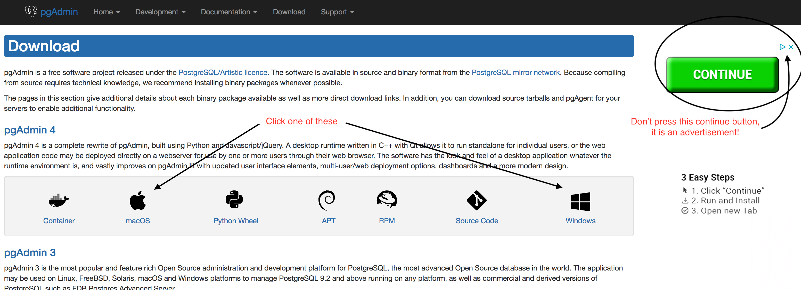
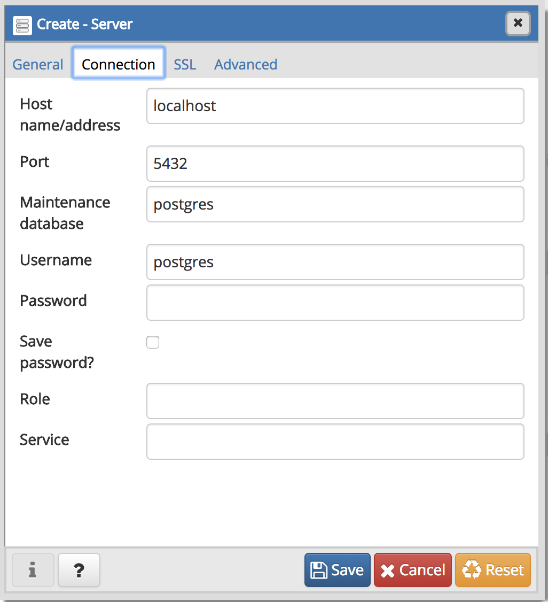

# README for API Installation: 1a. Installing PostgreSQL on Mac

[Back to Install Table of Contents](README_API_INSTALL.md)

## Installing and setting up PostgreSQL and pgAdmin4 using Homebrew on Mac
If unfamiliar with Homebrew, please see the instructions below this section to setup the WeVote server. Otherwise continue with the sections below this one.

To install PostgreSQL run the following command (assuming you've installed Homebrew on your Mac).
```
brew install postgresql
```

Start PostgreSQL by running

```
brew services start postgresql
```

To create a database and log into PostgreSQL use:

```
createdb
psql
```

You should see a prompt with your name pop-up which means everything works as expected. Once you've asserted it works, you may exit with Crtl+Z. You have to create a second user called postgres in order to be able to connect with and log in to pgAdmin. 

```
createuser -s postgres
```

You should create a password for this superuser. Log back in using `psql` and run:

```
ALTER USER  postgres  WITH PASSWORD '<your-password-here>';
```

Now you are ready to install pgAdmin4. Run:

```
brew cask install pgadmin4
```

Now open pgAdmin by clicking on the icon in your applications folder. From here on, you may follow the instructions in the `Setup - Install pgAdmin 4` section of this README starting from step 1: Right-click on "Servers" and choose "Create > Server".

Note that you may terminate your PostgreSQL once done with:

```
brew services stop postgresql
```

## Installing PostgreSQL on Mac

Otherwise, you can follow the below instructions to setup PostgreSQL.

Install the latest version of Postgres for your machine (see instructions further down on this page as well):
 
**Mac:** Download and install the DMG from [http://postgresapp.com/](http://postgresapp.com/)


 
(Alternate: Go to [https://www.postgresql.org/download/](https://www.postgresql.org/download/).)

Run this on your command line:

    export PATH=$PATH:/Applications/Postgres.app/Contents/Versions/latest/bin

Start up the command line for postgres (there is an 'open psql' button/navigation item if you installed postgresapp.
Run these commands:

    create role postgres;
    alter role postgres with login;

Install PGAdmin4. Go to [https://www.pgadmin.org/download/](https://www.pgadmin.org/download/).

[Having troubles? See Installation Troubleshooting](README_INSTALLATION_TROUBLESHOOTING.md)

## Setup - Install pgAdmin 4

We recommend installing pgAdmin 4 as a WYSIWYG database administration tool.  

If you have used earlier versions MacOS versions of PgAdmin, you may be surprised to see that pgAdmin4 is no longer an 
app, "The desktop runtime now runs as a system tray application and utilises the browser on the system to display pgAdmin."
in other words, it is now a webapp that runs at [http://127.0.0.1:55011/browser/](http://127.0.0.1:55011/browser/)

NOTE: You may need to turn off the restriction in "Security & Privacy" on "unidentified developers"
to allow this tool to be installed.
See: http://blog.tcs.de/program-cant-be-opened-because-it-is-from-an-unidentified-developer/

In pgadmin add a server. You can use your sign in name as the server name.

Change the PostgreSQL server access permissions to allow administration by PGAdmin4. Open this file:

    $ sudo vi "/Users/<YOUR_NAME>/Library/Application Support/Postgres/var-10/pg_hba.conf"

Change the line:

    # "local" is for Unix domain socket connections only
    local   all             all                                     trust
to

    # "local" is for Unix domain socket connections only
    local   all             all                                     peer

    
Now you should reload the server configuration changes by stopping and staring PostgreSQL and connect pgAdmin 4 to your PostgreSQL database server.

Open pgAdmin 4 and navigate to:

    Server Groups > Servers

1. Right-click on "Servers" and choose "Create > Server"

    

2. Name: WeVoteServer

    

3. Switch to "Connection" tab
   * Host name: localhost
   * Port: 5432
   * Maintenance database: postgres
   * User name: postgres

    

4. Press Save

## Create Database

If you do not see "WeVoteServerDB" in PGAdmin, try this command from your terminal window:

    $ sudo -u postgres createdb WeVoteServerDB

Or these commands:

    $ psql postgres -U postgres
    postgres=# CREATE DATABASE WeVoteServerDB;
    postgres=# \list
    postgres=# \q

[NEXT: 2. Get WeVoteServer Code from Github](README_API_INSTALL_CODE_FROM_GITHUB.md)

[Working with WeVoteServer day-to-day](README_WORKING_WITH_WE_VOTE_SERVER.md)

[Back to Install Table of Contents](README_API_INSTALL.md)
