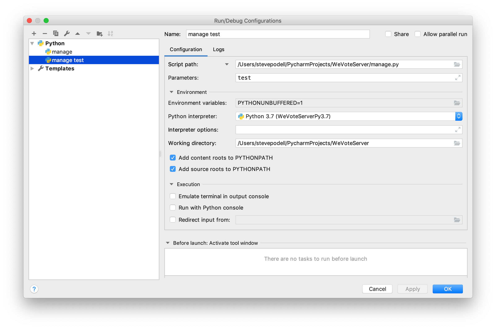

# Maintaining Django Tests

[Back to Install Table of Contents](README_API_INSTALL.md)

### Debugging Django Tests, setup

You can run from a terminal session
`(WeVoteServerPy3.7) $  ./manage.py test`
or `(WeVoteServerPy3.7) $  python manage.py test`

But if you are fixing a broken test, don't bother with the command line, setup a run configuration in PyCharm


This allows you to use the excellent PyCharm debugger.

### Django Tests preparation

Django makes it easy to start adding tests to a new project, by handling all the test enviroment setup automatically.  
Django finds your database setup from our environment_variables.json and then, for every test run, it creates a test 
instance of our database on the fly that it calls test_WeVoteServerDB, and uses it for the test, then drops it (deletes it) 
at the end of the test run.  The whole test run takes less than a half minute, so that create/destroy of the DB is fast.

**In order to be able to run the tests, you will need a fully setup WeVoteServer localhost install on your computer.**

In `config/local.py` there is a DATABASES array, make sure that every DB except for the default
DB has 

    'TEST': {
        'MIRROR': 'default',
    }

in it, otherwise the tests won't start, with database errors reported.


### Django Tests location

We have all our tests in the directory `apis_v1/tests`, but Django's test runner finds all the classes in the project 
that subclass TestCase, like this one: `class WeVoteAPIsV1TestsOrganizationFollow(TestCase):` and includes them in the
test run.

Tests succeed silently -- No postive status goes to the log and console, but failures are well documented in the console:

```
    ======================================================================
    FAIL: test_count_with_voter_device_id (apis_v1.tests.test_views_organization_count.WeVoteAPIsV1TestsOrganizationCount)
    ----------------------------------------------------------------------
    Traceback (most recent call last):
      File "/Users/monty/PycharmProjects/WeVoteServer/apis_v1/tests/test_views_organization_count.py", line 133, in test_count_with_voter_device_id
        success=json_data11['success'], voter_count=json_data11['voter_count']))
    AssertionError: 0 != 1 : success: True (voter_count '1' expected), voter_count: 0

```

### Typical failures to watch for

Python is an untyped language, so look for type errors 

    AssertionError: '1' != 1 : organization_id == 1 expected, organization_id: 1 returned

Throughout the WeVoteServer code base we build these status strings by appending more snake cased all caps strings when something interesting is detected, but
lots of our tests rely on specific text in the returned status string.  Exact assert matches are fragile, and will be likely to
break in the future.  Try matching on a substring, for example `'VOTER_NOT_FOUND' in json_data17['status']` instead of 
trying to match on `'VOTER_NOT_FOUND_FROM_VOTER_DEVICE_ID TWITTER_WHO_I_FOLLOW_LIST_NOT_RETRIEVED`, which is more likely
to change over time, thereby causing the test to fail.


### Disconnecting Connections and "Dropping" the test_WeVoteServerDB Database

This methodology works equally well if you want to drop the WeVoteServerDB (which should be very rarely needed!)

Ideally you will never need to do this, but if you do...

    (WeVoteServerPy3.7) $ psql
    psql (11.1)
    Type "help" for help.
    
    monty=# SELECT * from pg_database;
           datname       | datdba | encoding | datcollate | datctype | datistemplate | datallowconn | datconnlimit | datlastsysoid | datfrozenxid | datminmxid | dattablespace |                    datacl                    
    ---------------------+--------+----------+------------+----------+---------------+--------------+--------------+---------------+--------------+------------+---------------+----------------------------------------------
     postgres            |     10 |        6 | C          | C        | f             | t            |           -1 |         13363 |          561 |          1 |          1663 | 
     monty               |     10 |        6 | C          | C        | f             | t            |           -1 |         13363 |          561 |          1 |          1663 | 
     template1           |     10 |        6 | C          | C        | t             | t            |           -1 |         13363 |          561 |          1 |          1663 | {=c/monty,monty=CTc/monty}
     template0           |     10 |        6 | C          | C        | t             | f            |           -1 |         13363 |          561 |          1 |          1663 | {=c/monty,monty=CTc/monty}
     WeVoteServerDB      |  16385 |        6 | C          | C        | f             | t            |           -1 |         13363 |          561 |          1 |          1663 | 
     test_WeVoteServerDB |  16385 |        6 | C          | C        | f             | t            |           -1 |         13363 |          561 |          1 |          1663 | 
    (6 rows)
    
    monty=# SELECT pg_terminate_backend(pid) FROM pg_stat_activity WHERE datname = 'WeVoteServerDB';
     pg_terminate_backend 
    ----------------------
     t
     t
    (2 rows)
    
    monty=# \q
    (WeVoteServerPy3.7) $ 

    
You have just disconnected all the user and user processes that are attached to Postgres, now you can go into psql or pgAdmin4 and drop the database.
At this point you should be able to drop the DB from the command line command (but it never works for me!)  
    
  
    (WeVoteServerPy3.7) $ dropdb 'database test_WeVoteServerDB'
    dropdb: database removal failed: ERROR:  database "database test_WeVoteServerDB" does not exist
    (WeVoteServerPy3.7) $ 

So I just drop it within pgAdmin4, by right clicking on the 'test_WeVoteServerDB' and selecting 'Delete/Drop'

### Django Tests

See the Django documentation for [Writing and running tests](https://docs.djangoproject.com/en/2.1/topics/testing/overview/#module-django.test)

The [Django testing docs](https://docs.djangoproject.com/en/dev/topics/testing/overview/#the-test-database) explain that in cases where you wish to preserve 
(i.e. not destroy) an existing test database, you can use the `--keepdb` option.

[Back to Install Table of Contents](README_API_INSTALL.md)
