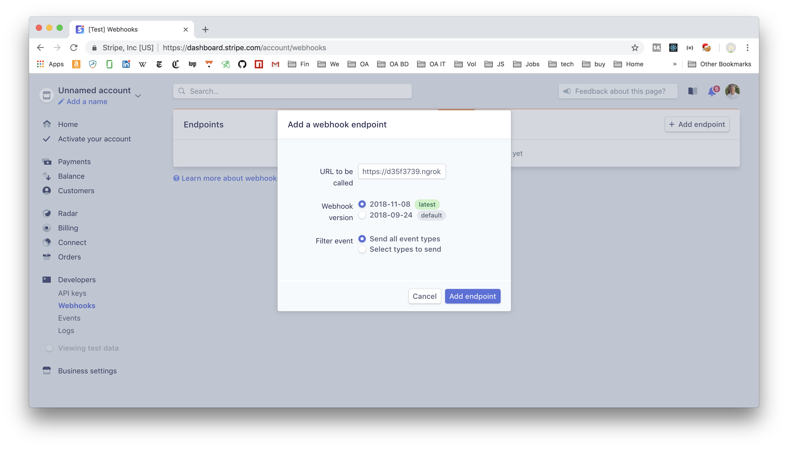

# Donation System Setup (for testing donations on your local)

[Back to Install Table of Contents](README_API_INSTALL.md)


## Setting up openssl on your local for Stripe testing

**If you've already updated your openssl and installed pyopenssl during the setup of your virtual environment, then you can skip to step 4**

In order to test Stripe transactions, your local will need to be updated to TLS1.2. For OS X, see instructions below.
For other operating systems go here (https://support.stripe.com/questions/how-do-i-upgrade-my-openssl-to-support-tls-1.2). 

For Mac OS X, type in your terminal:

1. `brew install openssl`

   After installation, check the version: `openssl version`
   
   If it's not showing 1.0.2 as the most recent version, then you need to symlink to the updated openssl version like so:
    
   * `ln -s /usr/local/Cellar/openssl/1.0.2h_1/bin/openssl /usr/local/bin/openssl `
   
   * open a new terminal window to continue:
   
2. `brew install python3`

	Reinitialize virtual environment in your WeVoteServer folder if the version of python you have installed is still
	pointing to the old openssl path (this might entail deleting bin/python and reinstalling python, then )
	 
	* `pip install -r requirements.txt ` (you might need to attempt pip install several times for it to fully install)
	
3. `python3 -m pip install pyopenssl pyasn1 ndg-httpsclient` 

4. `pip install stripe`


**Testing the Stripe Webhook**

After using the Stripe API to initiate a donation against a donor's credit card, stripe sends a confirmation message back 
to the WeVote Server via a webhook.  The webhook is simply one of our server APIs that we register with
stripe through their dashboard.  When Stripe calls our webhook, we take the incoming message and add it to the status 
records for each donation as recorded in Postgres.

This section shows how to get the Stripe donation webhook to pass through to your local, so that you can test how it will 
work in production.

1. Get the Stripe console credentials for stripe@wevote.us from Dale in order to debug the webhook, then login 
    [https://dashboard.stripe.com/login](https://dashboard.stripe.com/login)

1. Setting up a ngrok tunnel

    "What is ngrok? ngrok exposes local servers behind NATs and firewalls to the public internet over secure tunnels."

    "How it works: You download and run a program on your machine and provide it the port of a network service, usually a 
web server.

    It connects to the ngrok cloud service which accepts traffic on a public address and relays that traffic through to the 
ngrok process running on your machine and then on to the local address you specified."

    This allows you to run a tunnel server on your local, so that a Webhook request from Stripe to the ngrok server that you setup, gets redirected to your local.  While the ngrok server is running, it is like having a static address on the 
public internet.

    Download and install ngrok, follow the steps on [https://dashboard.ngrok.com/get-started](https://dashboard.ngrok.com/get-started)

    For the testing that we will be doing with Stripe, the free ngrok account is all you need.

    Start ngrok on the same port that your Python/Django local server is running on, in my example port 8000.

    So in my example any http request to http://df35f3739.ngrok.io on the public internet will end up redirected to my local
Python server's port 8000.

    ```
    (WeVoteServer3.6) Steves-MacBook-Pro-32GB-Oct-3171:PythonProjects stevepodell$ ./ngrok http 8000
    
    ngrok by @inconshreveable                        (Ctrl+C to quit)
    
    Session Status                online     
    Account                       Steve Podell (Plan: Free) 
    Version                       2.2.8 
    Region                        United States (us)   
    Web Interface                 http://127.0.0.1:4040 
    Forwarding                    http://d35f3739.ngrok.io -> localhost:8000   
    Forwarding                    https://d35f3739.ngrok.io -> localhost:8000  
      
    Connections                   ttl     opn     rt1     rt5     p50     p90 
                                  0       0       0.00    0.00    0.00    0.00 
     ```

    Keep this ngrok server running in a terminal window, since everytime you restart (with the free version) 
    your URL changes.  (A mac going to sleep, does not cause the tunnel to be destroyed, and once you
    open up your computer, the tunnel resumes at the same Forwarding address.)

1. Configure the stripe test account to send the webhook to your ngrok server

    In production the webhook endpoint will be [https://api.wevoteusa.org/apis/v1/donationStripeWebhook/](https://api.wevoteusa.org/apis/v1/donationStripeWebhook/)

    But in our test environment (for this example) it will be [https://d35f3739.ngrok.io/apis/v1/donationStripeWebhook/](https://d35f3739.ngrok.io/apis/v1/donationStripeWebhook/)

    

    From the screen above, copy the Signing secret, and paste it into environment_variables.json in the STRIPE_SIGNING_SECRET field.

1.  Your config.js on your WebApp setup should look like this...

    ```
    // Note that we import these values into "webAppConfig" (so we can search for it)
    module.exports = {
      WE_VOTE_URL_PROTOCOL: "http://", // "http://" for local dev or "https://" for live server
      WE_VOTE_HOSTNAME: "localhost:3000", // This should be without "http...". This is "WeVote.US" on live server.
    
      WE_VOTE_SERVER_ROOT_URL: "http://localhost:8000/",
      WE_VOTE_SERVER_ADMIN_ROOT_URL: "http://localhost:8000/admin/",
      WE_VOTE_SERVER_API_ROOT_URL: "http://localhost:8000/apis/v1/",
      WE_VOTE_SERVER_API_CDN_ROOT_URL: "http://localhost:8000/apis/v1/",
    
      // WE_VOTE_SERVER_ROOT_URL: "https://api.wevoteusa.org/",
      // WE_VOTE_SERVER_ADMIN_ROOT_URL: "https://api.wevoteusa.org/admin/",
      // WE_VOTE_SERVER_API_ROOT_URL: "https://api.wevoteusa.org/apis/v1/",
      // WE_VOTE_SERVER_API_CDN_ROOT_URL: "https://cdn.wevoteusa.org/apis/v1/",
    ```

1. Run `npm run` on your WebApp

    And your localhost WebApp should be communicating with your localhost Python server.

1.  Send a test webhook from the console, using charge.updated - the dummy data it sends will not effect anything, but you should see
a note in the Python Console log ...

    ```
    [2019-01-04 09:49:22,530] [INFO] Steves-MacBook-Pro-32GB-Oct-3171.local:donate.controllers: WEBHOOK received: donation_process_stripe_webhook_event: charge.updated
    [2019-01-04 09:49:22,531] [INFO] Steves-MacBook-Pro-32GB-Oct-3171.local:donate.controllers: WEBHOOK ignored: donation_process_stripe_webhook_event: charge.updated
    ```

    this confirms that the webhook is successfully communicating with your test setup.

**If the Webhook starts failing**

1. End users might see "waiting" displayed indefinitely on their donation subscription page, since the
webhook is required for updating that data.

1. Whoever is signed up for the stripe account will start receiving emails from support@stripe.com titled "Stripe webhook delivery issues for https://api.wevoteusa.org"

1. The Splunk logs will start showing messages like...

   ```[2019-01-08 15:50:52,788] [ERROR] api-3:apis_v1.views.views_donation: donation_stripe_webhook_view, Stripe returned SignatureVerificationError: No signatures found matching the expected signature for payload```

One of the first thing to check is that the STRIPE_SECRET_KEY value on the production 
server matches what is shown on the [Stripe console](https://dashboard.stripe.com/account/apikeys)

The stripe console now has the ability to look at Stripe logs of all the recent transactions of our access to the Stripe API, and great logging
that shows each Webhook initiated by Stripe.


[Back to Install Table of Contents](README_API_INSTALL.md)
 
