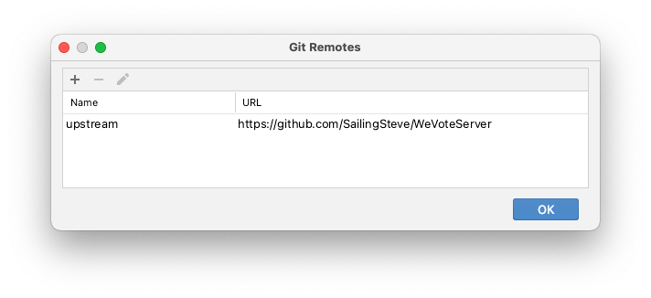
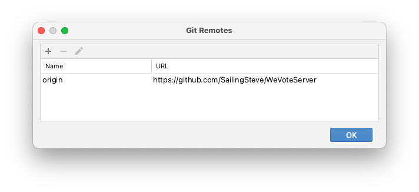
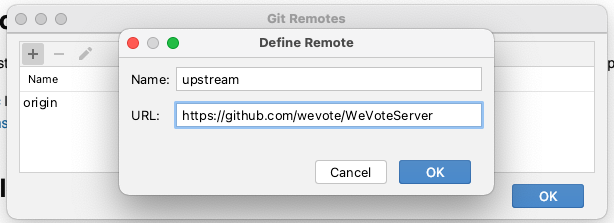
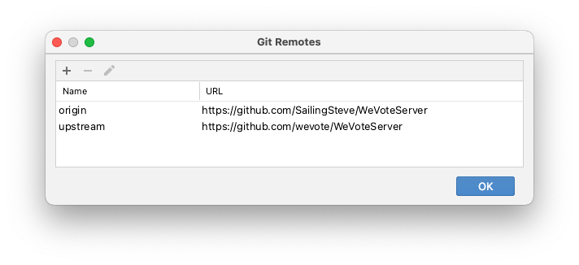
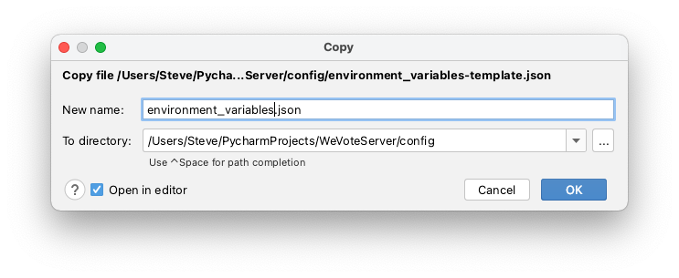
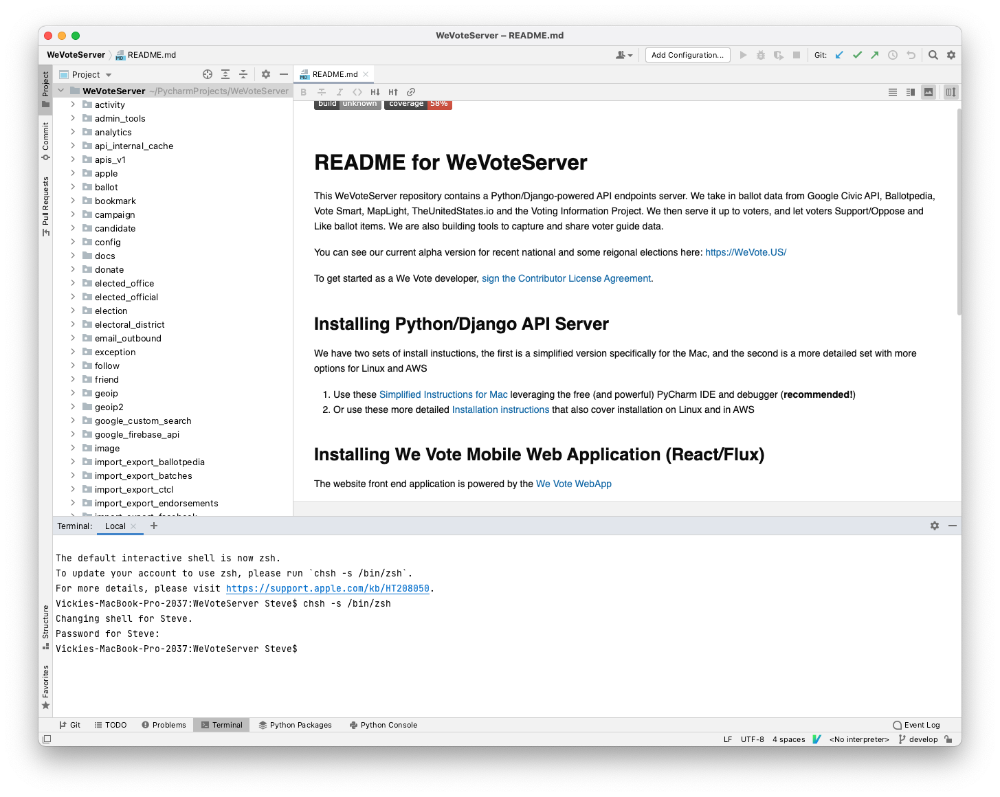
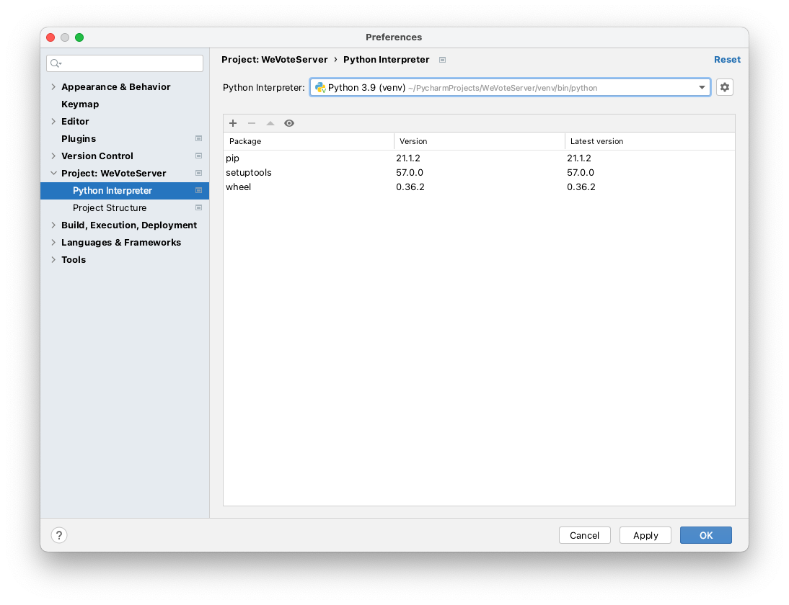

# README for Simplified Installation with PyCharm on a Mac
[Back to root README](../README.md)


**Caveat:  Operating Systems, IDEs, tools, packages, dependencies, and languages are constantly changing.**
We do our best to keep this procedure current with the external changes.  Tell us if you run into troubles.

## Installing WeVoteServer: On a new Mac
These instructions are for a new Mac, or at least a Mac that hasn't been used for 
Python development before.  Some of these tools may already be setup on your Mac, but
reinstalling them causes no harm, skip the parts you are sure you already have.

If you have never installed Postgres on your Mac (or don't mind fully deleting any Postgres that you have already 
installed on your Mac), follow these instructions.  They should take an hour or so to complete. 

1. Install the Chrome browser for Mac

2. Open the Mac "App Store" app, and download the current version of Apple's Xcode, which includes "c" language compilers 
    and native git integration. This download also includes Apple's Xcode IDE for macOS and iOS native development.

    **Note: Xcode requires about 30 GB of disk space, if you don't have much that room on your Mac, it is sufficient 
    to download only the "Xcode Command Line Tools".  Unfortunately you need to sign up as an Apple developer to do that.
    Download (the latest version of) "Command Line Tools for Xcode 13" at 
    [https://developer.apple.com/download/more/](https://developer.apple.com/download/more/).  These tools only require 185 MB 
    of disk space.  If you choose to download only the tools, skip on to Step 6.**
    
    If you have enough disk space, it is much easier to just install all of Xcode (including the full Xcode IDE) from 
    the app store:
     

3. Start xcode (you can find it with Spotlight, or in the Application folder)

     

4. When prompted, download the "Additional Components" (the Command Line Tools).  This takes many minutes to complete.

5. When you get to "Welcome to Xcode", quit out of the app. (For the WeVoteServer, we only need the command line tools that 
come with Xcode.)

    

6. Navigate in Chrome to [GitHub](https://GitHub.com).  Create a personal account if you don't already have one.
 
7. Within the GitHub site, navigate to [https://GitHub.com/wevote/WeVoteServer](https://GitHub.com/wevote/WeVoteServer). 
    Create a fork of wevote/WeVoteServer.git by selecting the "Fork" button (in the upper right of screen).
    
    

8. Download and install the Community version of PyCharm, it's free!
    [https://www.jetbrains.com/pycharm/download/#section=mac](https://www.jetbrains.com/pycharm/download/#section=mac)

9. StartPyCharm, and press the 'Get from VCS' button.

    

10. Clone your fork of the git repository, by copying the URL to the repository into the URL filed, then press the Clone button.
_What this means in english is that you have created a copy in GitHub of the WeVoteServer codebase, and cloning it downloads
a copy of your copy to your Mac.  At this instant, the 'develop' branch of wevote/WeVoteServer matches
    your branch (in this example) SailingSteve/WeVoteServer and also matches the code on your Mac.

    

11. The PyCharm IDE appears in 'Dracula' mode, with the repository loaded to your disk, and ready to edit.

     

12. If you like 'Dracula' mode, you can skip this step.  Open PyCharm/Preferences and press the
'Sync with OS' button to match the display mode of your Mac.  
   
     
     

13. In PyCharm/Preferences/Plugins enable the Markdown and IdeaVim tools (this takes a while).  
Feel free to add any other PyCharm tools that you would like!  When done press 'Ok', and the IDE will reboot.

     

14. If the Apple top menu, shows "Git" skip this step.  If it says "VCS", the follow this step to configure Git

     
   
    Select 'Git' on the VCS meu, and press Ok.
   
     

15. In PyCharm set your git remotes. Navigate to the Git/'Manage Remotes...' dialog

    

    The WeVoteServer project defines upstream and origin differently than most projects.

    Click the edit (pencil) icon, and change the word origin to upstream. This is how it looks after the change.
   
    

16. Then add a remote for your private branch by pressing the '+' button on the Git Remotes dialog.  Add the url for your
     fork of the WeVoteServer project origin (copy the url from the GitHub website). In this example, the developer 
     is "SailingSteve".
    
    
      
17. When the cloning is complete, it will look something like this.
    
     
    
     Press Ok to close the dialog

18. In PyCharm copy `environment_variables-template.json` to `environment_variables.json`

     

     Right click on `environment_variables-template.json` and select 'Copy', then right click paste on the `config` 
     directory and select 'Paste' in the pop-up, and then in the copy dialog that open up, and change the "new name:" to 
     `environment_variables.json`
    
     If you skip this step, in a much later step, when you run "makemigrations", it will fail with an 
     'Unable to set the **** variable from "os.environ" or JSON file' error.
    
     **There are a number of secret values in `environment_variables.json` that are not in source control,
     you will need to check in with Dale, as you find that you need them.**

19. In PyCharm, open the Terminal window and accept use of the z shell (if you want to use some other shell, feel free to skip this step).
   
     

     The terminal opens up with the project root directory set as the pwd (which is handy).

20. In the PyCharm terminal window download [Homebrew]( https://brew.sh/) ("the missing package manager for macOS") by entering
the following command:
    
     ``` 
     $ /bin/bash -c "$(curl -fsSL https://raw.GitHubusercontent.com/Homebrew/install/master/install.sh)"
     ``` 

     This loads and runs a Ruby script (Ruby comes pre-installed in macOS), and Ruby uses curl (also pre-loaded) to pull the file 
    into the bash (terminal) command shell for execution.  This Ruby script also internally uses 'sudo' which temporarily gives 
     the script root privileges to install software, so you will need to know an admin password for your Mac.  

     This script can take a few minutes to complete.

21. Install the latest version of Python

     ```
     $ brew install python
     ```
     If an older version of Python has been installed, and the installation fails, you will see the following error:
     ```
     Error: python@3.9 3.9.1_1 is already installed
     To upgrade to 3.9.5, run:
       brew upgrade python@3.9
     Steve@Vickies-MacBook-Pro-2037 WeVoteServer % 
     ```
     In which case you run the suggested upgrade command, in this example it would be `brew upgrade python@3.9`, then finally export the path as shown below.
     ```
     $ export PATH="/usr/local/opt/python/libexec/bin:$PATH"
     ```
22. Test that the newly installed Python is in the path. macOS comes with Python 2 preinstalled, so
if the reported version is 2, then add the newly loaded python to the path with the export command. 
Then confirm that the default python is now version 3.9 or later.  (Version 3.6 has problems with macOS Big Sur or later)

     ```
     Steve@Vickies-MacBook-Pro-2037 WeVoteServer % python --version
     Python 2.7.16
     Steve@Vickies-MacBook-Pro-2037 WeVoteServer % export PATH="/usr/local/opt/python/libexec/bin:$PATH"
     Steve@Vickies-MacBook-Pro-2037 WeVoteServer % python --version                                     
     Python 3.9.5
     Steve@Vickies-MacBook-Pro-2037 WeVoteServer % 
     ```   
     2021: For an 'Apple M1 Max' ARM-64 Processor...
     ```
     stevepodell@Steves-MBP-M1-Dec2021 WeVoteServer % python --version
     Python 2.7.18
     stevepodell@Steves-MBP-M1-Dec2021 WeVoteServer % export PATH="/opt/homebrew/opt/python@3.9/libexec/bin:$PATH"
     stevepodell@Steves-MBP-M1-Dec2021 WeVoteServer % python --version                                            
     Python 3.9.9
     stevepodell@Steves-MBP-M1-Dec2021 WeVoteServer % 
     ```
   
23. If python --version fails,
    try 
    ```
    ln -s /opt/homebrew/bin/python3 /opt/homebrew/bin/python
    ```
bneeded to install postgres before the requirements because psyco3-3 binary requires pg_config which is not installed yet.


25. Set up a Virtual Environment with the new Python Interpreter.  
Navigate to: PyCharm/Preferences/Project: WeVoteServer/Python Interpreter.

     

26. Click the Gear icon, then select "Add".  PyCharm will detect the latest interpreter from the PATH environment variable, 
    and pre-populate the dialog.  Check the two checkboxes `Inherit global site-packages` and `make available to all projects`.
   
     

    Confirm that the 'Base interpreter' field shows us using the Python version that you just downloaded, and it knows the location for pip, setuptools, and wheel (3 python utilities).
    Then press Ok.
   
    

27. Confirm that the new virtual environment is in effect, by closing all open Terminal windows within
PyCharm and opening a new one.

     

    If you see '(venv)' at the beginning of the command line, all is well.
   
28. Install OpenSSL, the pyopenssl and https clients:
 
     `(WeVoteServerPy3.7) $ brew install openssl`
     If it is already installed, no worries!

29. Link libssl and libcrypto so that pip can find them:
     ```
     $ ln -s /usr/local/opt/openssl/lib/libcrypto.dylib /usr/local/lib/libcrypto.dylib
     $ ln -s /usr/local/opt/openssl/lib/libssl.dylib /usr/local/lib/libssl.dylib
     ```
30. Install libmagic

     `(WeVoteServerPy3.7) $ brew install libmagic`

31. Install all the other Python packages required by the WeVoteServer project (there are a lot of them!)

     `(WeVoteServer3.7) $ pip3 install -r requirements.txt`

     This is a big operation that loads a number of wheels definitions and then compiles them.   Wheels are
     linux/macOS binary libraries based on c language packages and compiled with gcc. 
     Wheels allow python library developers to speed up execution by coding critical or complex sections the c language.
     Interpreted Python code runs slower than compiled c. 
    
     If this installation succeeds with no missing libraries, or other compiler errors, we are
     almost done.  If this installation fails, please ask for help.


## Install and set up PostgreSQL and pgAdmin4

1. If you are sure that Postgres has not already been installed, and is not currently running on this Mac, you can skip
this step.  To see if postgres is already running, check with lsof in a terminal window `lsof -i -P | grep -i "listen" | grep postgres`:

    ```
    (venv) $ lsof -i -P | grep -i "listen" | grep postgres
    postgres  13254 admin    5u  IPv6 0x35032d9cf207f247      0t0  TCP localhost:5432 (LISTEN)
    postgres  13254 admin    6u  IPv4 0x35032d9d01cd2647      0t0  TCP localhost:5432 (LISTEN)
    (venv) $
    ```  
 
    If the output shows postgres has already been installed and is listening on port 5432.  Stop and fix this,  
    otherwise you would install a second postgres instance running on port 5433, and the result would be hours of "port 
    assignment" mess to clean up. 
   
    **If that lsof line returns nothing**, then you don't currently have postgres running, and you can continue on to the next step.

    or
   
    **If you don't mind fully deleting any Postgres database data that you have already installed**, then delete the existing Postgres now.  If you installed postgres with homebrew try `brew uninstall postgresql`, 
    but if that fails Postgres can be setup in many ways, so there are no detailed instructions here on how to delete Postgres (but. You can start with running `which postgres`
    in a terminal and going to that directory and deleting the instance or the symbolic links to the instance.  
    Next step is to reboot your Mac to see if Postgres starts up again.

    or

    **If you have to keep some data that is already stored in the Postgres instance on your Mac** that you absolutely need to 
    retain, then you will need to manually upgrade Postgres.  This is a ton of work, and is rarely necessary.
   
3. Install PostgreSQL by running the following command:

    `(venv) $ brew install postgresql`

4. Start PostgreSQL (this is actually instructing the macOS [launchd](https://en.wikipedia.org/wiki/Launchd) to start 
    Postgres every time you start your Mac):

    `(venv) $ brew services start postgresql`

5. Create a default database, and a default user, and then log into the 'psql postgres' PostgreSQL command interpreter ("postgres=#" is the command prompt, you should not have to type this in):

    _New way: November 2021, using Postgres 14.0_
    ```
   (PycharmEnvironments) stevepodell@Steves-MacBook-Pro-32GB-Oct-2109 ~ % psql postgres
   psql (14.0)
   Type "help" for help.
   
   postgres=# createdb
   postgres=# createuser -s postgres    (TODO 7/8:  CREATE ROLE postgres WITH SUPERUSER CREATEDB CREATEROLE LOGIN ENCRYPTED PASSWORD ‘stevePG’;
   postgres=# \du
                                        List of roles
      Role name  |                         Attributes                         | Member of 
    -------------+------------------------------------------------------------+-----------
     stevepodell | Superuser, Create role, Create DB, Replication, Bypass RLS | {}
    
   postgres=# create database WeVoteServerDB;
   CREATE DATABASE
   postgres=# grant all privileges on database WeVoteServerDB to postgres;
   GRANT
   postgres=# \l
                                        List of databases
          Name      |    Owner    | Encoding | Collate | Ctype |      Access privileges      
   ----------------+-------------+----------+---------+-------+-----------------------------
     WeVoteServerDB | stevepodell | UTF8     | C       | C     |                   (TODO 7/8/22 these don't match the latest setup) 
     postgres       | stevepodell | UTF8     | C       | C     | 
     template0      | stevepodell | UTF8     | C       | C     | =c/stevepodell             +
                    |             |          |         |       | stevepodell=CTc/stevepodell
     template1      | stevepodell | UTF8     | C       | C     | =c/stevepodell             +
                    |             |          |         |       | stevepodell=CTc/stevepodell
     wevoteserverdb | stevepodell | UTF8     | C       | C     | =Tc/stevepodell            +
                    |             |          |         |       | stevepodell=CTc/stevepodell+
                    |             |          |         |       | postgres=CTc/stevepodell
   (5 rows)
   postgres=#
   ```
   brew created a superuser 'stevepodell' with no password, you can add a password within psql if you wish.

   _old way ..._

    ```   
    (venv) $ createdb
    (venv) $ createuser -s postgres
    (venv) $ psql
    psql (11.1)
    Type "help" for help.
    
    admin=# 
    ```

    The `psql` command starts a PostgresSQL command session which is started in the bash terminal window. Within this 
    PostgresSQL command session type the following Postgres commands... ("admin" is just an example password, use whatever
    password you would like to go with your postgres role name.)

    ```
    admin=# ALTER USER postgres WITH PASSWORD 'admin';
    ALTER ROLE
    admin=# \du
                                       List of roles
     Role name |                         Attributes                         | Member of 
    -----------+------------------------------------------------------------+-----------
     admin     | Superuser, Create role, Create DB, Replication, Bypass RLS | {}
     postgres  | Superuser, Create role, Create DB                          | {}
    
    admin-# \q
    (venv) $
    ```

    That `\du` command confirms that we have a 'postgres' role.  The `\q` command quits psql.

6. Now you are ready to install pgAdmin4 (a powerful WYSIWYG database administration tool that is open source 
 and built by volunteers (Many thanks to the pgAdmin team!)). Run:

   `(venv) $ brew install --cask pgadmin4`
    
   This can take a few minutes to complete.  When `brew install --cask pgadmin4` finishes, it prints out `Moving App 'pgAdmin 4.app' to '/Applications/pgAdmin 4.app'.`

   The latest pgAdmin4 has a webapp architecture (it is not a compiled program).  The app you start from the Application folder is actually a 
   single purpose web server, and the UI for the app appears.  (7/8/22 needs a new )

7. Use Spotlight to find and launch the pgAdmin4 app.  Once launched, the pgAdmin4 webapp will display in a new tab within Chrome.
   On that new tab, click on the "Add new Servers" button and choose "Create > Server"
   
    

8. On the first tab of the "Create - Server" dialog, add into the Name field: WeVoteServer

    

9. Switch to "Connection" tab, and enter the following information:
   * Host name: localhost
   * Port: 5432
   * Maintenance database: postgres
   * User name: postgres
   * Password: <your private password for the postgres user>  (mine is stevePG)
   * Save password: checked

    

10. Press Save

11. Create the Database by right-clicking on Databases in the server tree on the left. Then select  
    Create > Database on the cascading menu
     

12. Name the new database WeVoteServerDB and press save.

     
   
    <!-- owner is 'admin' in the picture, but defaulted to 'postgres' in my install -->

## Initialize an empty WeVoteServerDB

1. Create an empty log file on your computer to match the one expected by the app as configured in the environment_variables.json file:

    ```
    (venv) $ sudo mkdir /var/log/wevote/
    (venv) $ sudo touch /var/log/wevote/wevoteserver.log
    (venv) $ sudo chmod -R 0777 /var/log/wevote/
    ```

    As configured by default in our configuration code from GitHub, only errors get written to the log.
    Logging has five levels: CRITICAL, ERROR, INFO, WARN, DEBUG.
    It works as a hierarchy (i.e., INFO picks up all messages logged as INFO, ERROR and CRITICAL), and when adding logging 
    code we specify the level assigned to each message. You can change this to info items by changing the LOG_FILE_LEVEL variable 
    in the WeVoteServer/config/environment_variables.json file to "INFO".
    
    **Note:** Logging slows down Python app execution in production, so only use it for very important or very rarely used code or 
    code that is only used by the admin pages by developers.  You can also write your log files at the DEBUG level, and then they
    won't execute on the production server.

1. "Migrations are Django’s way of propagating changes you make to your software models into your local postgres database schema."
   Everytime you create a table, change a field name or description, you are changing the model, and those changes need to 
   be incorporated into the on-disk database schema.

   Run 'makemigrations' to gather all the schema information that is needed to initialize the WeVoteServer database:

    ```
    (venv) $ python manage.py makemigrations
    (venv) $ python manage.py makemigrations wevote_settings
    ```
     (January 28, 2019:  that second makemigrations for the wevote_settings table should not be necessary, but as of today, 
     it is necessary.  That second makemigrations line will be harmless, if it becomes unnecessary at some point.)
   
1. Run 'migrate'.  Django "migrate is responsible for applying and un-applying migrations."

    `(venv) $ python manage.py migrate`
 
## Set up a PyCharm run configuration

1. Set up a run configuration (this will enable the green play button, and the green debug button on the top line)
   
   Click in the "Add Configuration..." field that is to the left of the play button.

    
    
   
   Press the '+' sign in the upper-left corner of the dialog.  

    

   Then select Python, and click 'Add new run configuration...'

    

   For "Script path", add the path 
   to your `manage.py` file that will be in your project root directory, and for "Parameters" add `runserver` as the command.  
   Then press "Ok".
   
    

1.  Run the app:  Press the triangular Run button on the top line of the ide.  Note that a run window opens at the bottom of the IDE,
    on the same line as the "Terminal" tab.
    As API calls arrive at the server, the http requests will be displayed in this runtime log.

    Python print commands, only send their output to this log.  Python logger commands send the output
    to both this runtime log, and the log file that we created a few steps back.  On the production servers in AWS, these 
    log lines can be searched using Splunk (ask Dale for Splunk access if you could use it.)

1.  Now, with the server still running, open a terminal window, and create an account for yourself to login to the 
    management pages of the WeVoteServer.
    
    At WeVote, we call end users "voters".  This new "voter" will have all the 
    rights that you (as a developer) need to log in to 
    [http://localhost:8000/admin/](http://localhost:8000/admin/).  Once logged in you can start synchronizing data (downloading ballot and issue 
    data from the master server in the cloud, to your local server).
    
   The usage is:  `python manage.py create_dev_user first_name last_name email password`

    ```
    (WeVoteServer3.7) admin$ python manage.py create_dev_user Samuel Adams samuel@adams.com ale 
    Creating developer first name=Samuel, last name=Adams, email=samuel@adams.com
    End of create_dev_user
    (WeVoteServer3.7) admin$ 
    ```
    
1.  Navigate to [http://localhost:8000/admin/](http://localhost:8000/admin/) and sign in with your new username/password  (for example mine is stevepodell/stevePG.).    

1.  Your local instance of the WeVoteServer is now setup and running (although there is no election 
    data stored in your Postgres instance, for it to serve to clients at this point).

## import some ballot data from the live production API Server

   
**This page of instructions has covered steps 1 through 5 of the multi-page instructions, so now you can skip to step 6 to 
load some ballot data.**

Step 6:  [Set up Initial Data](README_API_INSTALL_SETUP_DATA.md)

[Back to root README](../README.md)


-----------
     
## June 14, 2021, Changes that were necessary for macOS Big Sur

**This is not list of sequential steps to complete a re-installation.  This list describes a few problems
that occurred, what was done to work around them.**

*  macOS BigSur (11.3.1) was complaining about Python 3.6.1, and the app would not work, so
   I upgraded Python to the latest 3.9.1
   
    

*  Uninstall Python (which was previously installed with Homebrew)
   ```
   (venv) stevepodell@Steves-MacBook-Pro-32GB-Oct-2109 pkgconfig % brew uninstall --ignore-dependencies python3
   ```
   
*  Install the latest Python
    ```
    (venv) stevepodell@Steves-MacBook-Pro-32GB-Oct-2109 pkgconfig % brew install python3
   ```
   
*  Brew (re)link the python
    ```
    stevepodell@Steves-MacBook-Pro-32GB-Oct-2109 ~ % brew link python@3.9
    ```

*  Needed link it again to clear warnings about overwriting other links
    ```
    stevepodell@Steves-MacBook-Pro-32GB-Oct-2109 ~ % brew link --overwrite python@3.9
   ```
*  In the PyCharm IDE UI
    1)  Navigate to PyCharm/Preferences/'Project: WeVoteServer'/'Python Interpreter' and press the gear icon and set up
    a path to 3.9
    1) On the 'Python Interpreter' summary pop-up select 'WeVoteServer 3.9' (or the latest version you installed).
       
        

    1) Open a **new** terminal window in the IDE, and run `python --version` to double-check that it is using Python 3.9

    1) Close the older terminal windows, that will have confused paths to the older python versions.

*  Get the latest requirements.txt from git.

*  Install the latest setuptools
   ```
   (venv) stevepodell@Steves-MacBook-Pro-32GB-Oct-2109 WeVoteServer % pip3 install --upgrade setuptools   
   ```
   
*  Try to install requirements.txt in the Pycharm terminal window
    ```
    (venv) stevepodell@Steves-MacBook-Pro-32GB-Oct-2109 WeVoteServer % pip3 install -r requirements.txt
   ```
   
*  If the installation fails, run brew's doctor
    ```
    (venv) stevepodell@Steves-MacBook-Pro-32GB-Oct-2109 WeVoteServer % brew doctor
   ```
   
*  brew cleanup
    ```
    (venv) stevepodell@Steves-MacBook-Pro-32GB-Oct-2109 WeVoteServer % brew cleanup
   ```
   
*  I had an old String.h first in the path, and causing a `fatal error: 'cstddef' file not found` error in String.h
   ```
    (venv) mv /usr/local/include/String.h /usr/local/include/String.h.saveoff
   ```
   
*  This final installation of requirements.txt worked
    ```
    (venv) stevepodell@Steves-MacBook-Pro-32GB-Oct-2109 WeVoteServer % pip3 install -r requirements.txt
   ```
   
*  If problems appear with the openid package...

    Look in External Libraries/site-packages and use 'pip uninstall' to remove any libraries with 'openid' in their
    name, and then try 'pip3 install -r requirements.txt' to reload openid.

*  'pip3 install -r requirements.txt' does not reload openid, try from the command line

    Try these commands, one at a time, in this order:
    ```
    pip install -e git+git://GitHub.com/necaris/python3-openid.git@master#egg=openid
    pip install -e git+git://GitHub.com/necaris/python3-openid.git@master#egg=python3-openid
    ```