# README for Simplified Installation with PyCharm on a Mac
[Back to root README](../README.md)

## Installing WeVoteServer: On a new Mac
These instructions are for a new Mac, or at least a Mac that hasn't been used for 
Python development before.  Some of these tools may already be setup on your Mac, but
reinstalling them causes no harm, skip the parts you are sure you already have.

If you have never installed Postgres on your Mac (or don't mind fully deleting any Postgres that you have already 
installed on your Mac), these instructions should take an hour or so to complete. 

1. Install the Chrome browser for Mac

1. Open the Mac "App Store" app, and download the current version of Apple's Xcode, which includes "c" language compilers 
    and native git integration. This download also includes Apple's Xcode IDE for MacOS and iOS native development.

    **Note: Xcode requires about 30 GB of diskspace, if you don't have much that room on your Mac, it is sufficient 
    to download only the "Xcode Command Line Tools", but you need to sign up as an apple developer to do that.  Download (the latest version of) "Command Line Tools (macOS 10.14) for Xcode 10" at 
    [https://developer.apple.com/download/more/](https://developer.apple.com/download/more/)  These tools only require 185 MB 
    of disk space.  If you choose to download only the tools, skip on to Step 6.**
    
    If you have enough disk space, it is much easier to just install all of Xcode (including the full Xcode IDE) from 
    the app store:
    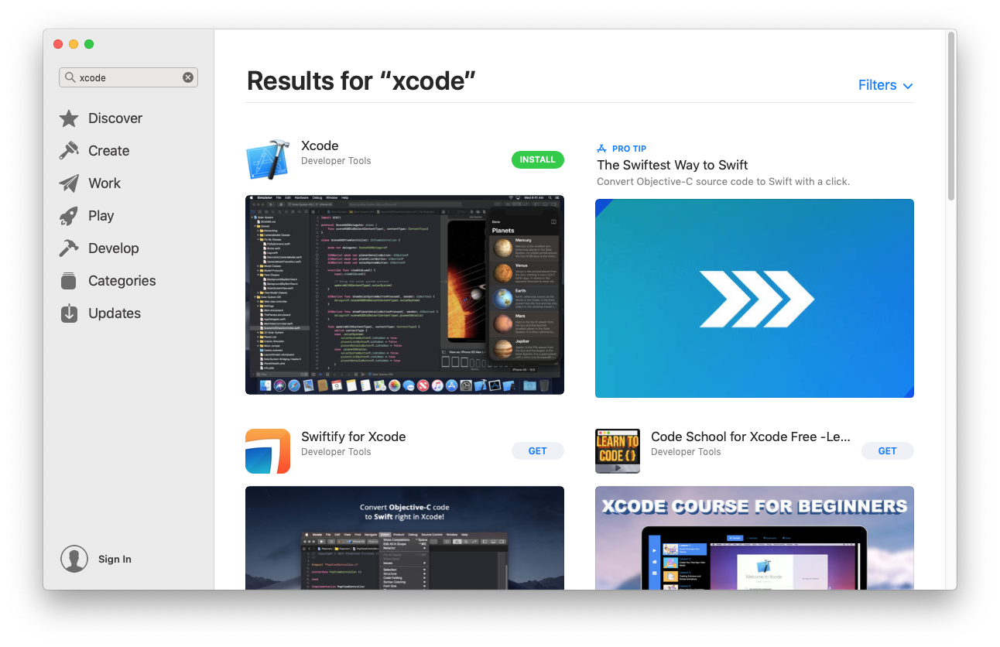

1. Start xcode (you can find it with Spotlight, or in the Application folder)

    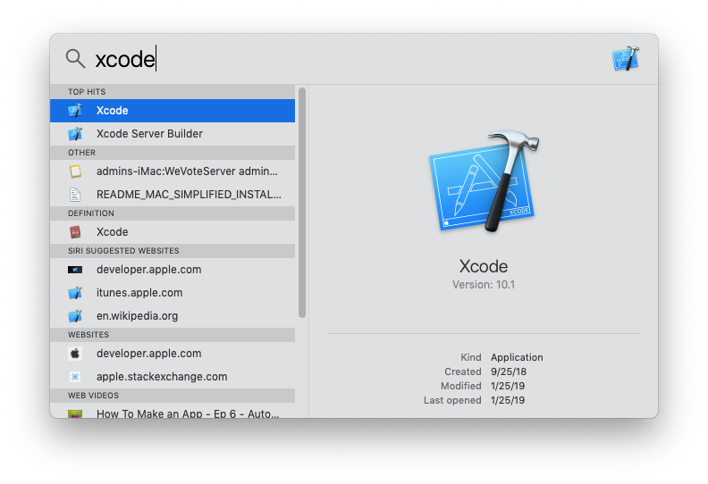

1. When prompted, download the "Additional Components" (the Command Line Tools).  This takes a many minutes to complete.

1. When you get to "Welcome to Xcode", quit out of the app. (For the WeVoteServer, we only need the command line tools that 
come with Xcode.)

    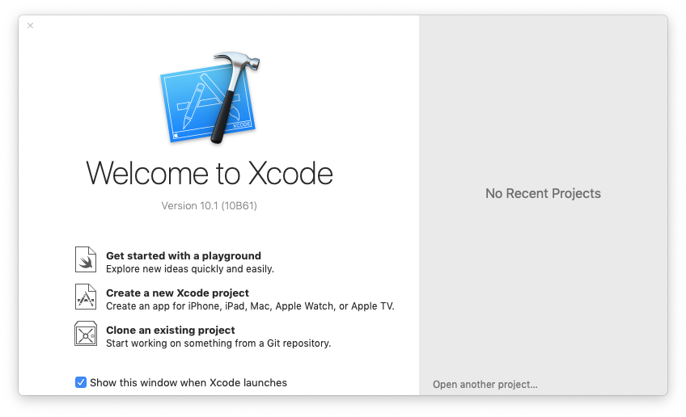

1. Download and install the Community version of PyCharm, it's free!
    [https://www.jetbrains.com/pycharm/download/#section=mac](https://www.jetbrains.com/pycharm/download/#section=mac)

1. Start PyCharm and enable the Markdown and BashSupport tools (this takes a while).  Feel free to add any other PyCharm tools
that you would like!

    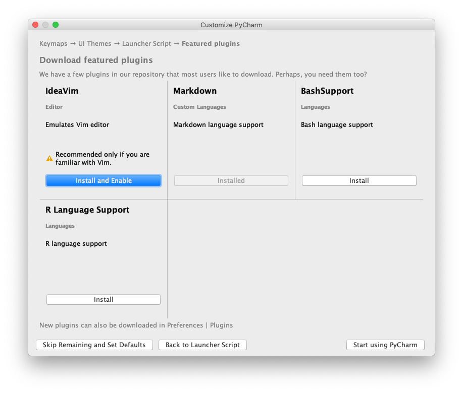

1. Navigate in Chrome to [github](https://github.com).  Create a personal account if you don't already have one.
 
1. Within the github site, navigate to [https://github.com/wevote/WeVoteServer](https://github.com/wevote/WeVoteServer). 
    Create a fork of wevote/WeVoteServer.git by selecting the "Fork" button (in the upper right of screen).
    
     
    
1. In PyCharm, check out the project development branch from github

    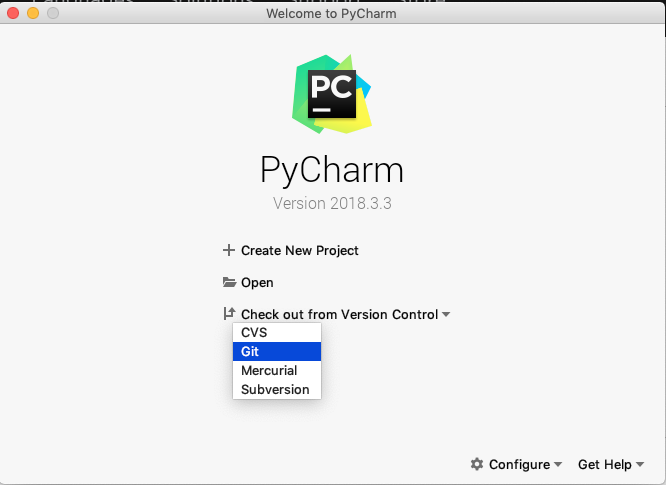
    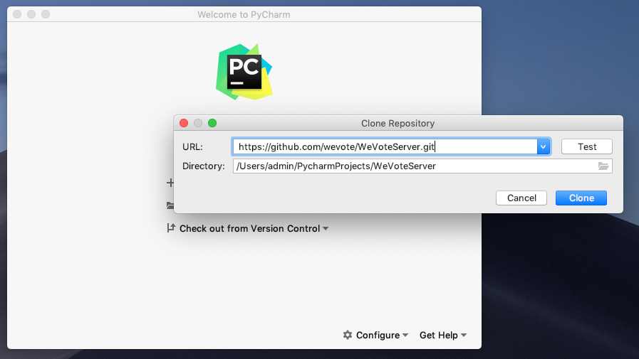

    After the checkout, answer yes to the "Would you like to open the directory ..." dialog
    
    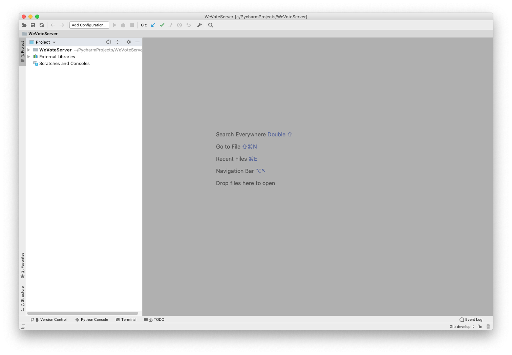
    
    Alternatively, using terminal, create a folder, cd to it and git clone the fork. `origin` will default to the fork.
    then do `git remote add upstream https://github.com/wevote/WeVoteServer.git`

11. In PyCharm, go to the VCS/Enable Version Control Integration menu choice dialog, and select "git".  But, if the Git option is
    already present in the middle of the pull down, and you don't see a "Enable Version Control Integration" option, don't worry
    about it -- PyCharm picked up that setting from a previous install or another JetBrains tool that you might have installed.

    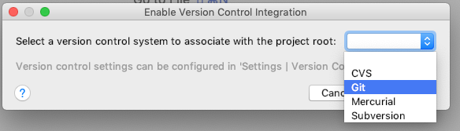

1. In PyCharm set your git remotes. Navigate to the remotes dialog

   
   
   The WeVoteServer project defines upstream and origin differently than most projects.
   
   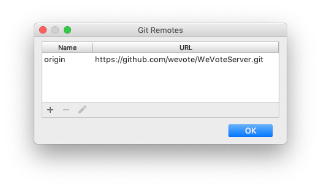
   
   Click the edit (pencil) icon, and change the word origin to upstream.  (We call the working development branch for the 
   project in GitHub "upstream"). This is how it looks after the change.
   
   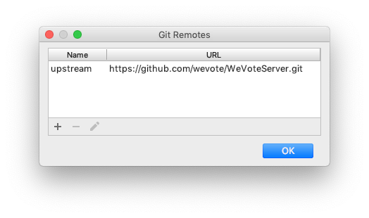
   
   <!-- The goal of this instruction set was to remove any steps that weren't absolutely necessary, and to leverage built 
   in GUI based operations in PyCharm in order to make the install non-techical as possible

   **Optional alternative way to do the same thing:** If you would prefer to directly edit the git configuration files, 
   there is another way to perform the same changes described in this step.  To change origin and upstream manually 
   from a terminal window, change into the WeVoteServer folder and then run, `vi .git/config`:
   
   ```
   [remote "origin"]
        url = git@github.com:YOUR_GITHUB_HANDLE_HERE/WeVoteServer.git
        fetch = +refs/heads/*:refs/remotes/origin/*
   [remote "upstream"]
        url = git@github.com:wevote/WeVoteServer.git
        fetch = +refs/heads/*:refs/remotes/upstream/*

   ```
    -->

1. Then add a remote for your private branch by pressing the "+ button on the Git Remotes dialog.  Add the url for your
    fork of the the WeVoteServer project origin (copy the url from the github website). In this example, the developer 
    is "SailingSteve".

   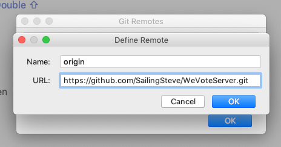
      
1.  When complete it will look something like this.
    
    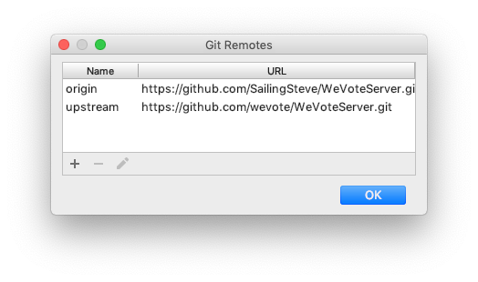

1. In the rest of these examples, the Mac computer name is "admins-imac" and the user name is "admin" (and that user
has admin privileges),  The virtual environment name is WeVoteServerPy3.7, which is just a name that we use to indicate
that the instance is running Python 3.7, when Python 3.8 comes out, feel free to adjust accordingly!

1. In PyCharm copy `environment_variables-template.json` to `environment_variables.json`

    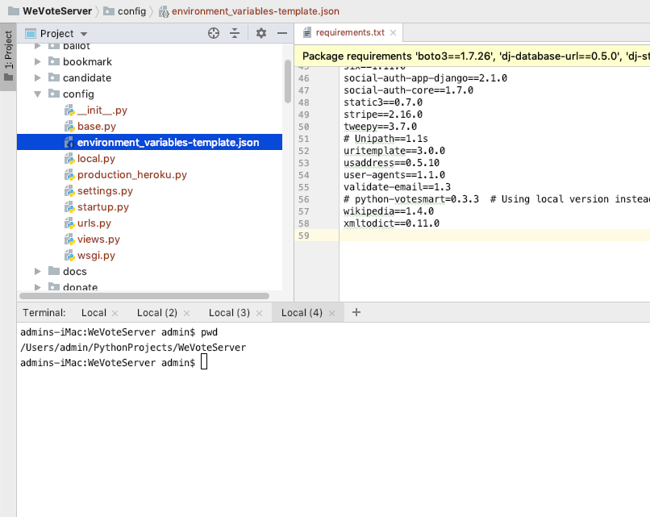

    Right click on `environment_variables-template.json` and select 'Copy', then right clik paste on the `config` 
    directory and select 'Paste' in the pop-up, and then in the copy dialog that open up, and change the "new name:" to 
    `environment_variables.json`
    
    If you skip this step, in a much later step, when you run "makemigrations", it will fail with an 
    'Unable to set the SECRET_KEY variable from os.environ or JSON file' error.
    
    **There are a number of secret values in `environment_variables.json` that are not in source control,
    you will need to check in with Dale, as you find that you need them.**

1. In PyCharm, open up the Terminal window (from the list of options on the second from the bottom line in the IDE).  Note that
the terminal opens up with the project root directory set as the pwd (which is handy).
         
1. In the PyCharm terminal window download [Homebrew]( https://brew.sh/) ("the missing package manager for MacOS") by entering
the following command:

    `$ /usr/bin/ruby -e "$(curl -fsSL https://raw.githubusercontent.com/Homebrew/install/master/install)"`
    
    This loads a Ruby script (Ruby comes pre-loaded in MacOS), and Ruby uses curl (also pre-loaded) to pull the file into the
    the bash (terminal) command shell for execution.  This Ruby script also internally uses 'sudo' which temporarily gives 
    the script root priviliges to install software, so you will need to know an admin password for your Mac.  

1. Install the latest Python

    ```
    $ brew install python
    $ export PATH="/usr/local/opt/python/libexec/bin:$PATH"
    ```

1. In the PyCharm/Preferences dialog (from the top line of the Mac), select Project: WeVoteServer then Project Interpreter.
   The dialog will show Python 2.7, the default that comes with MacOS, click the Gear icon, then select "Add".
   
   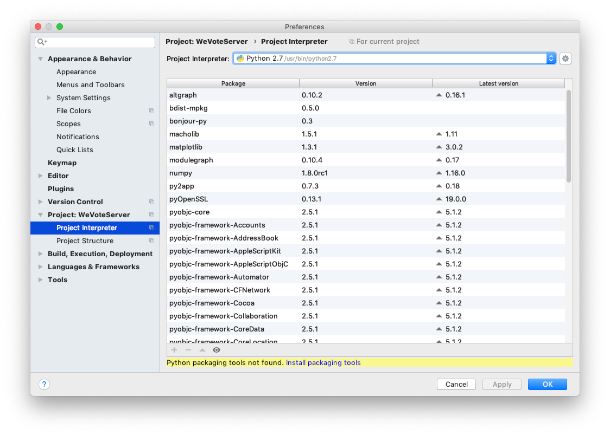
   
   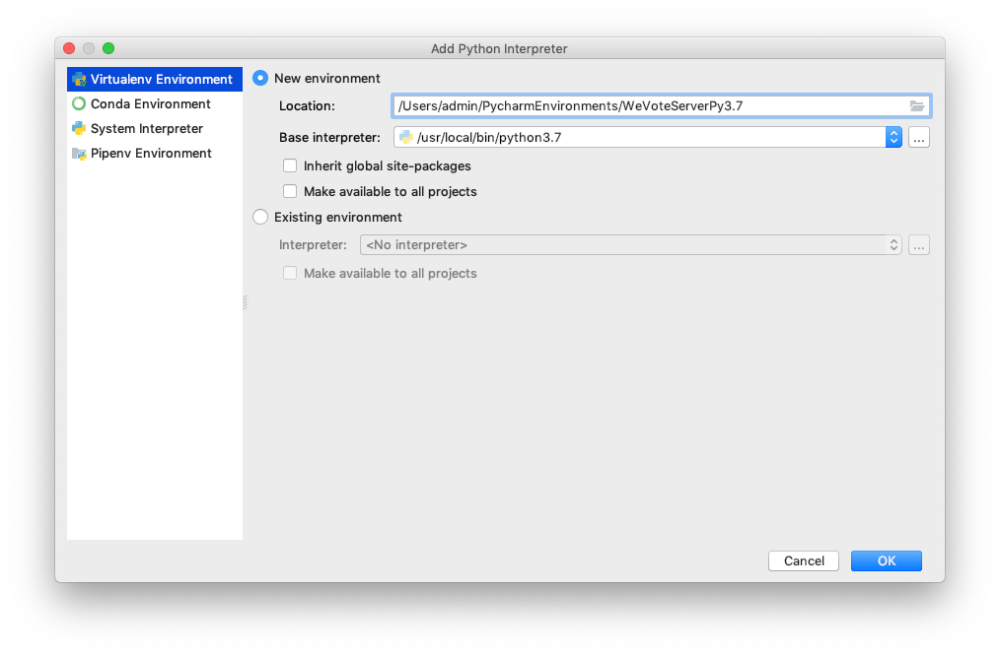
   
   Change the top "Location" line to read `/Users/admin/PycharmEnvironments/WeVoteServerPy3.7` (remember to substitute your
   user name for 'admin' in this example!) and the interpreter 
   pulldown to point to the Python 3.7 (that you installed with brew a few steps ago).   Then press Ok.
   
1. The Preferences pane is displayed again.   If there is a yellow warning at the bottom of the dialog that says to "Install latest 
    Python packaging tools", click it and install them, if you don't see this message, no worries. Finally on the Preferences 
    pane, press "Apply" then "Ok"   
   
   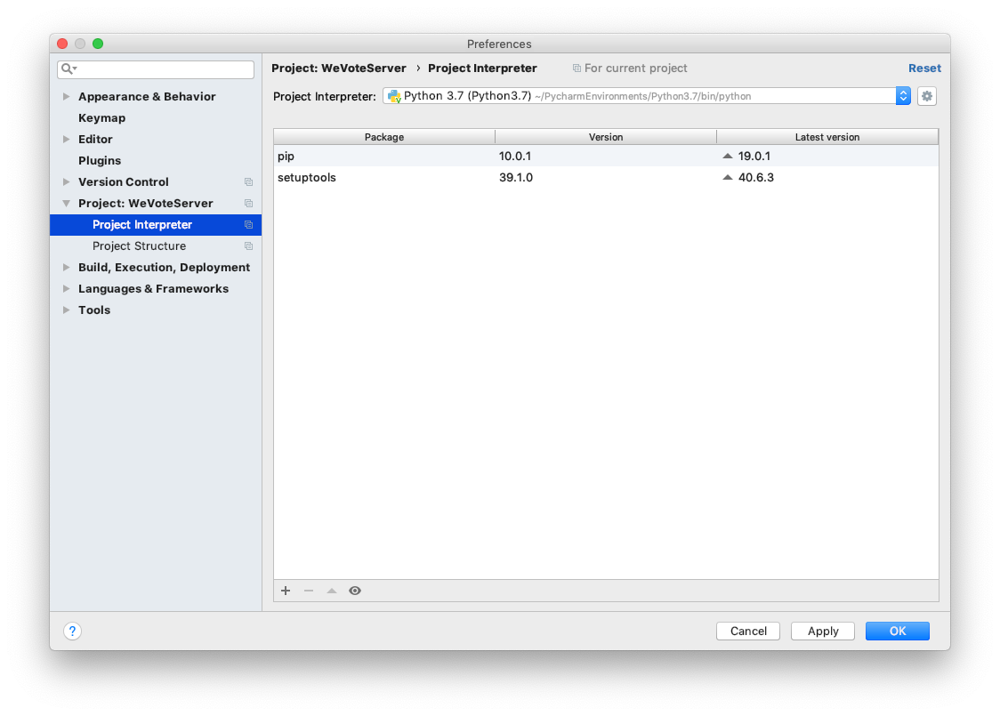
   
   Now Python "Run" (Play button) and terminal sessions execute within the `WeVoteServerPy3.7` virtual environment that you have setup, 
   without having any effect on the global environment settings of your Mac.  

1. In the PyCharm terminal, press the `+` button to open a new terminal session.
   Note that the terminal shows we are running in the `WeVoteServerPy3.7` virtual environment
   and in the terminal window, type `python --version` to confirm that the WeVoteServer
   and its terminal windows are running python 3.7
   
   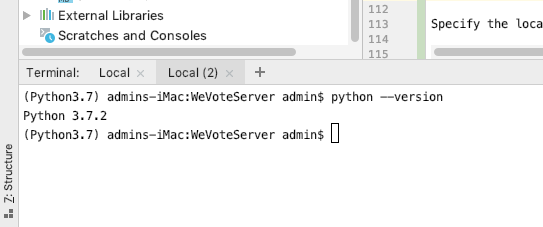

15. Install OpenSSL, the pyopenssl and https clients:
 
    `(WeVoteServerPy3.7) $ brew install openssl`
    
    If it is already installed, no worries!
    
    On some machines, both python 2 and python 3 are installed on your mac. If that is so, `python` launches python 2 and `python3` 
    launches python 3. Start by running the following comment (using 'pip3' instead of 'pip'). 
    If that doesn't work replace `pip3` below with `pip`.
    
    `(WeVoteServerPy3.7) $ pip3 install pyopenssl pyasn1 ndg-httpsclient`
    
    If running this command, causes some output to be displayed, that tells you to upgrade your pip version, follow 
    those instructions and do the install they recommend.  It never hurts to update pip.
    
    This is not needed for fresh installs, but may be needed for updating existing installs done with a different procedure.    
        
    1.  Link libssl and libcrypto so that pip can find them:
        ```
        $ ln -s /usr/local/opt/openssl/lib/libcrypto.dylib /usr/local/lib/libcrypto.dylib
        $ ln -s /usr/local/opt/openssl/lib/libssl.dylib /usr/local/lib/libssl.dylib
        ```
    
1. Install libmagic

    `(WeVoteServerPy3.7) $ brew install libmagic`

1. Install all the other Python packages required by the WeVoteServer project (there are a lot of them!)

    `(WeVoteServer3.7) $ pip3 install -r requirements.txt`

    This is a big operation that loads a number of wheels and then it compiles other 
    c language packages with gcc, for which a current wheel does not exist.  (Wheel or `*.whl` files are Python containers that contain
    pre-compiled c language objects.  Objects that are specifically pre-compiled for the current MacOS version).
    
    If this install succeeds with no missing libraries, or other compiler errors, we are
    most of the way to done.  If this command fails on the first try, try it again -- that usually resolves the problem.  This 
    should work the first time on a clean first install.
    
    Installing requirements.txt can fail for two reasons.
    First, it can expect 'python' to run python 3, but on some macs it runs python 2.
    You can this by adding `alias python='python3'` in your .bash_profile 
    
    The second failure was pg_config executable not found (detailed message below). This was resolved by first installing postgres
    then going back to `pip install -r requirements.txt`
    
    ```
    Collecting psycopg2 (from django-toolbelt==0.0.1->-r requirements.txt (line 11))
    Using cached https://files.pythonhosted.org/packages/5c/1c/6997288da181277a0c29bc39a5f9143ff20b8c99f2a7d059cfb55163e165/psycopg2-2.8.3.tar.gz
    ERROR: Complete output from command python setup.py egg_info:
    ERROR: running egg_info
    creating pip-egg-info/psycopg2.egg-info
    writing pip-egg-info/psycopg2.egg-info/PKG-INFO
    writing dependency_links to pip-egg-info/psycopg2.egg-info/dependency_links.txt
    writing top-level names to pip-egg-info/psycopg2.egg-info/top_level.txt
    writing manifest file 'pip-egg-info/psycopg2.egg-info/SOURCES.txt'
    
    Error: pg_config executable not found.
    ```
     
## Install and set up PostgreSQL and pgAdmin4

1. If you are sure that Postgres has not already been installed, and is not currently running on this Mac, you can skip
this step.  To see if postgres is already running, check with lsof in a terminal window `lsof -i -P | grep -i "listen" | grep postgres`:

    ```
    ((WeVoteServerPy3.7) $ lsof -i -P | grep -i "listen" | grep postgres
    postgres  13254 admin    5u  IPv6 0x35032d9cf207f247      0t0  TCP localhost:5432 (LISTEN)
    postgres  13254 admin    6u  IPv4 0x35032d9d01cd2647      0t0  TCP localhost:5432 (LISTEN)
    (WeVoteServerPy3.7) $
    ```  
 
     If the output shows postgres has already been installed and is listening on port 5432, then the command from the next step 
    (`brew install postgresql`) would install a second postgres instance running on port 5433, and then you would have hours of "port 
    assignment" mess to cleanup. 
   
    **If that lsof line returns nothing, then you don't currently have postgres running, and you can continue on to the next step.**

    or

    **If you don't mind fully deleting any Postgres that you have already installed, then delete the existing Postgres now.  Postgres
    can be setup in many ways, so there are no instructions here on how to delete Postgres. You can start with running `which postgres`
    in a terminal and going to that directory and deleting the instance or the symbolic links to the instance, then it is
    probably easiest to reboot your Mac to see if Postgres starts up again.**
    
    or
    
    **If you have to keep some data that is already stored in a Postgres instance that is installed on your Mac, then you must
    take the time to upgrade that Postgres to the latest version you need keep to the latest version (PostgreSQL 11.x as of February 2019) 
    before proceeding.**
    
1. Install PostgreSQL by running the following command:

    `(WeVoteServerPy3.7) $ brew install postgresql`

1. Start PostgreSQL (this is actually instructing the MacOS [launchd](https://en.wikipedia.org/wiki/Launchd) to start 
    Postgres every time you start your Mac):

    `(WeVoteServerPy3.7) $ brew services start postgresql`

1. Create a default database, and a default user, and then log into the 'psql' PostgreSQL command interpreter:

    ```
    (WeVoteServerPy3.7) $ createdb
    (WeVoteServerPy3.7) $ createuser -s postgres
    (WeVoteServerPy3.7) $ psql
    psql (11.1)
    Type "help" for help.
    
    admin=# 
    ```

    The `psql` command starts a PostgresSQL command session which is started in the bash terminal window, within this 
    PostgresSQL command session type the following Postgres commands... ("admin" is just an example password, use what ever
    password you would like to go with your postgres role name.)

    ```
    admin=# ALTER USER postgres WITH PASSWORD 'admin';
    ALTER ROLE
    admin=# \du
                                       List of roles
     Role name |                         Attributes                         | Member of 
    -----------+------------------------------------------------------------+-----------
     admin     | Superuser, Create role, Create DB, Replication, Bypass RLS | {}
     postgres  | Superuser, Create role, Create DB                          | {}
    
    admin-# \q
    (WeVoteServerPy3.7) $
    ```

    That `\du` command confirms that we have a 'postgres' role.  The `\q` command quits psql.

 1. Now you are ready to install pgAdmin4 (a powerful WYSIWYG database administration tool that is open source 
 and built by volunteers (Many thanks to the pgAdmin team!)). Run:

    `(WeVoteServerPy3.7) $ brew cask install pgadmin4`
    
    The latest pgAdmin4 has a webapp architecture, where the app you start from the Application folder is actually a 
    single purpose web server, and the UI for the app appears in Chrome as a local website.

1. Use Spotlight to find and launch the pgAdmin4 app and the pgAdmin4 webapp will display in a new tab within Chrome.
    On that new tab, Right-click on "Servers" 
    and choose "Create > Server"

    When brew cask install pgadmin4 finishes, it prints out `Moving App 'pgAdmin 4.app' to '/Applications/pgAdmin 4.app'.`

    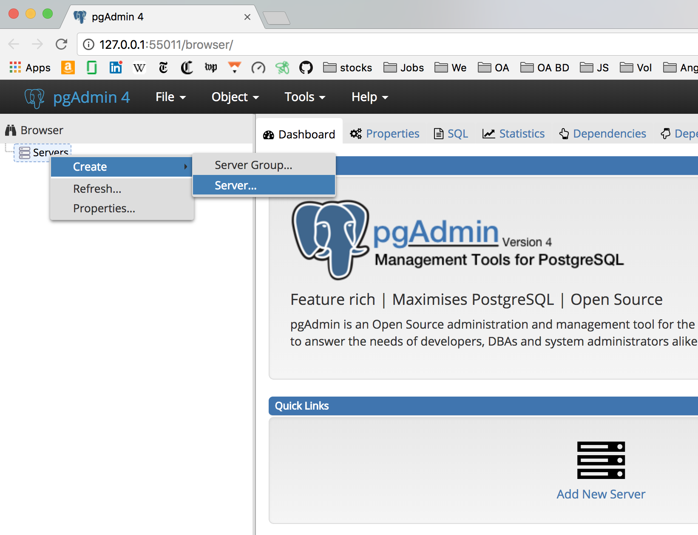

2. On the first tab of the "Create - Server" dialog, add into the Name field: WeVoteServer

    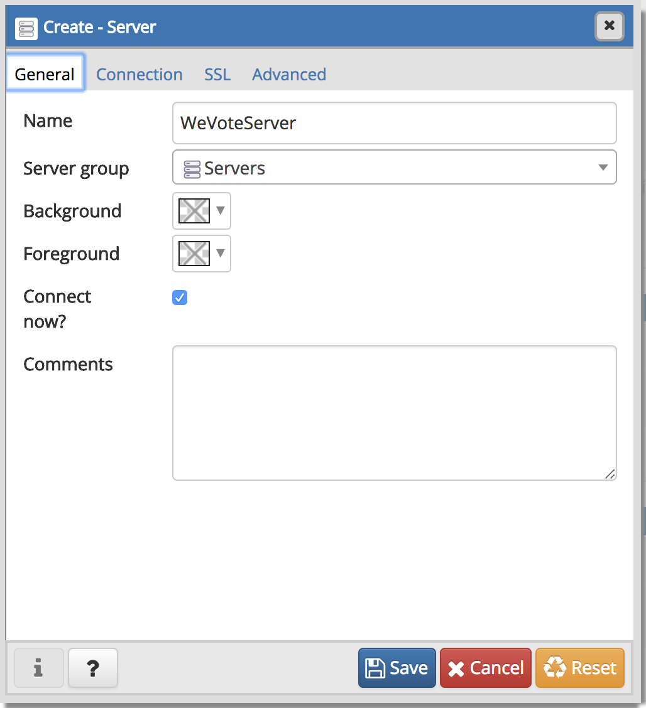

3. Switch to "Connection" tab, and enter the following information:
   * Host name: localhost
   * Port: 5432
   * Maintenance database: postgres
   * User name: postgres
   * Password: <your private password for the postgres user>
   * Save password: checked

    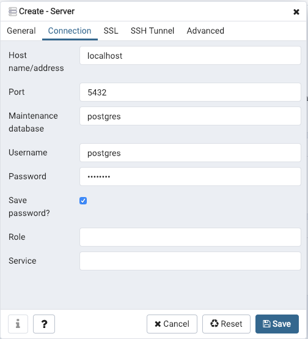

9. Press Save

10. Create the Database by right clicking on Databases in the server tree on the left. and select Create > Database on the 
cascading menu
   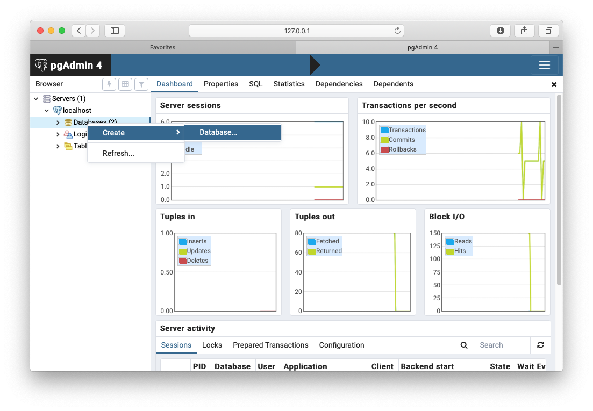

1. Name the new database WeVoteServerDB and press save.
   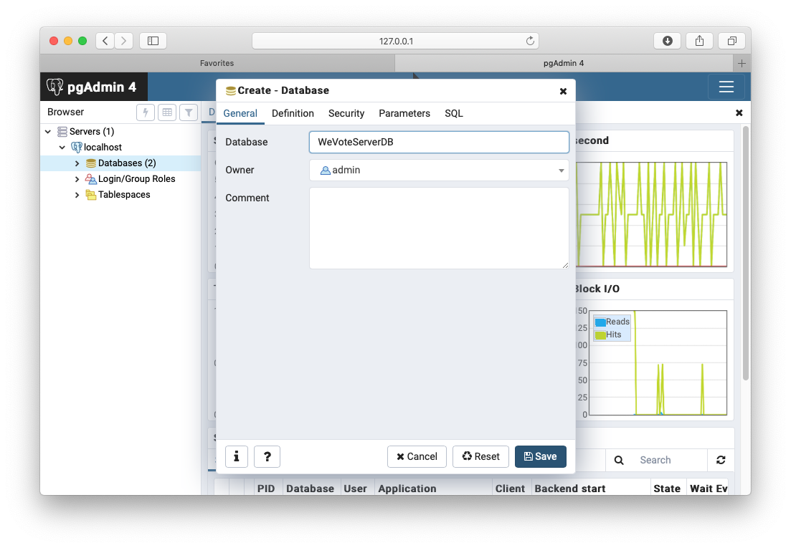
   
   <!-- owner is 'admin' in the picture, but defaulted to 'postgres' in my install -->

## Initialize an empty WeVoteServerDB

1. Create an empty log file on your computer to match the one expected by the app as configured in the environment_variables.json file:

    ```
    (WeVoteServerPy3.7) $ sudo mkdir /var/log/wevote/
    (WeVoteServerPy3.7) $ sudo touch /var/log/wevote/wevoteserver.log
    (WeVoteServerPy3.7) $ sudo chmod -R 0777 /var/log/wevote/
    ```

    As configured by default in our configuration code from github, only errors get written to the log.
    Logging has five levels: CRITICAL, ERROR, INFO, WARN, DEBUG.
    It works as a hierarchy (i.e. INFO picks up all messages logged as INFO, ERROR and CRITICAL), and when adding logging 
    code we specify the level assigned to each message. You can change this to info items by changing the LOG_FILE_LEVEL variable 
    in the WeVoteServer/config/environment_variables.json file to "INFO".
    
    (Logging causes Python to run slower in production, so only use it for very important or very rarely used code or 
    code that is only used by the admin pages by developers.  You can also write your log files at the DEBUG level and they
    won't execute on the production server.)

1. "Migrations are Django’s way of propagating changes you make to your models (creating a table, adding a field, deleting a model, etc.) 
    into your database schema." Run makemigrations to prepare for initialzing the WeVoteServer database:

    ```
    (WeVoteServerPy3.7) $ python manage.py makemigrations
    (WeVoteServerPy3.7) $ python manage.py makemigrations wevote_settings
    ```
     (January 28, 2019:  that second makemigrations for the wevote_settings table should not be necessary, but as of today, 
     it is necessary.  That second makemigrations line will be harmless, if it becomes unnecessary at some point.)
     
     You might see the following error at the start of any invocation of manage.py, but it doesn't stop the script:
     ```
     Configuration error, the stripe secret key, must begin with 'sk_' -- don't use the publishable key on the server!
     ```
    
2. Run migrate.  Django "migrate is responsible for applying and unapplying migrations."

    `(WeVoteServerPy3.7) $ python manage.py migrate`
    
1. Setup a run configuration in PyCharm (this will enable the playbutton and the debug button on the top line)    

   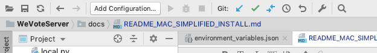
   
   Press the "Add Configuration..." button that is to the left of the play button.  Select "Templates" and then "Python".
   
   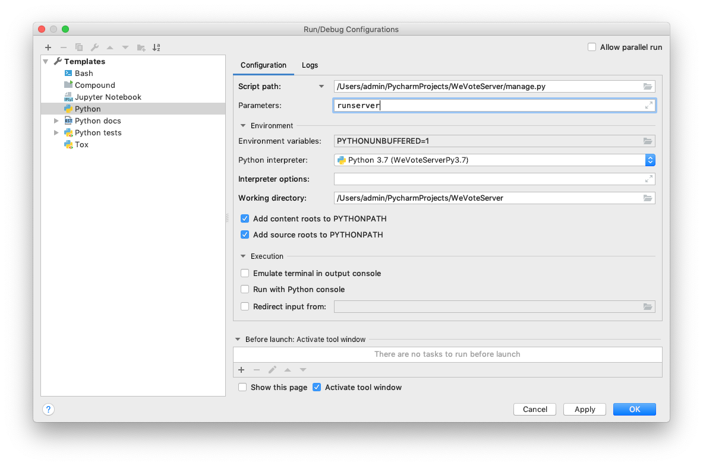
   
   With Python selected, and press the "+" button to create a new run configuration.  For "Script path", add the path 
   to your `manage.py` file that will be in your project root directory, and for "Parameters" add `runserver` as the command.  
   Then press "Ok".
   
    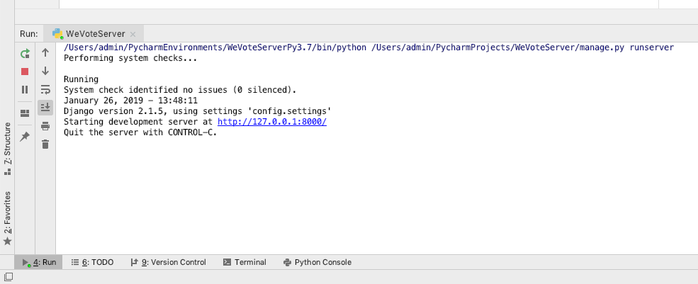
    
    1. Press the triangular Run button on the top line of the ide, and note that a run window opens at the bottom of the IDE,
    on the same line as the "Terminal" tab.  As API calls are made to the server, the http requests will be displayed in 
    this runtime log.  Python print commands, only send their output to this log.  Python logger commands send the output
    to both this runtime log, and the log file that we created a few steps back.  On the production servers in AWS, these 
    log lines can be searched using Splunk (ask Dale for Splunk access if you could use it.)
   
1.  Now, with the server still running, open a terminal window, and create a simple default user (a voter) so you can login to the 
    managment pages of the WeVoteServer.  At We Vote, "voters" are what we call end users.  This new "voter" will have all the 
    rights that you (as a developer) need to login to 
    [http://localhost:8000/admin/](http://localhost:8000/admin/) and start synchronizing data (downloading ballot and issue 
    data from the master server in the cloud, to your local server).

    The useage is:  python manage.py create_dev_user first_name last_name email password

    ```
    (WeVoteServer3.7) admin$ python manage.py create_dev_user Samuel Adams samuel@adams.com ale 
    Creating developer first name=Samuel, last name=Adams, email=samuel@adams.com
    End of create_dev_user
    (WeVoteServer3.7) admin$ 
    ```
    
1.  Navigate to [http://localhost:8000/admin/](http://localhost:8000/admin/) and sign in with your new user name/password.    
  
1.  The local instance of the WeVoteServer is now setup and running (although there is no election data stored in Postgres, 
    for it to serve to clients at this point).

## import some ballot data from the live production API Server

   
**This page of instructions has covered steps 1 through 5 of the multi-page instructions, so now you can skip to step 6 to 
load some ballot data.**

Step 6:  [Set up Initial Data](README_API_INSTALL_SETUP_DATA.md)

[Back to root README](../README.md)


