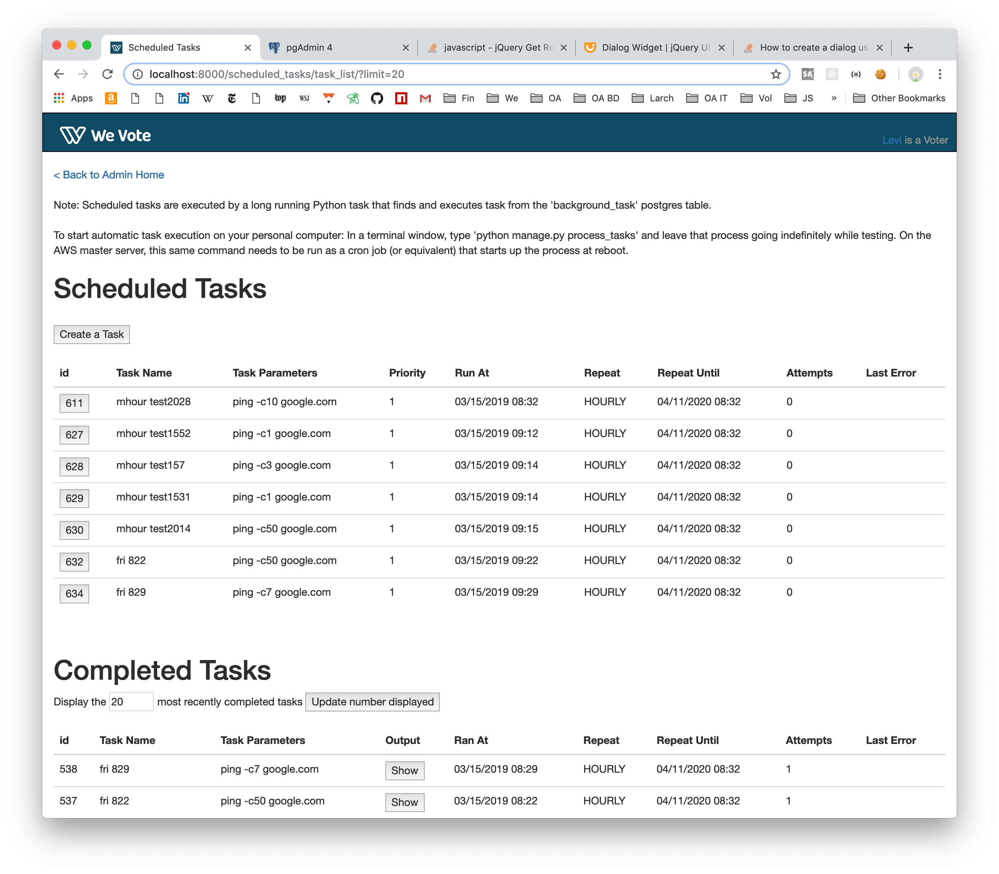
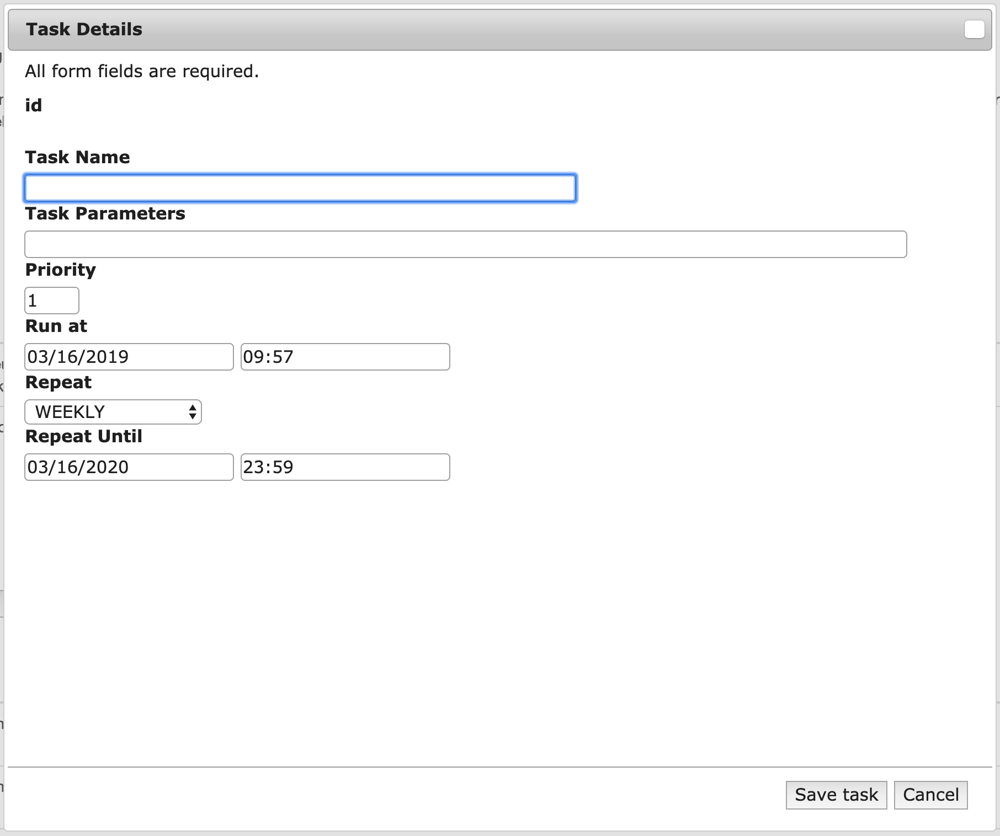
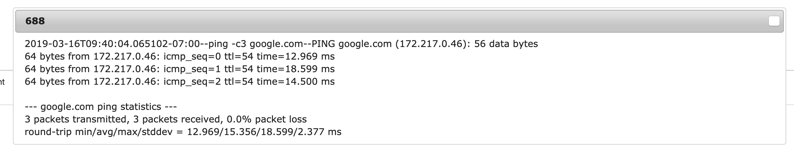

# Scheduled Tasks

[Back to Home](../README.md)

Scheduled tasks are executed by a long running Python task that finds and executes task from the 'background_task' Postgres table. 

To start automatic task execution on your personal computer: In a terminal window, type `python manage.py process_tasks` 
and leave that process going indefinitely while testing. On the AWS master server, this same command needs to be run as a cron job (or equivalent) that starts up the process at reboot.

### The Scheduled Tasks Screen

The Scheduled Task screen in the server Admin app.

Clicking on one of the number `id` buttons on the left under Scheduled Tasks, allows you to view more details about a 
scheduled task, and to use that setup as a basis of a new task via the 'Save as a new task' button, or delete the task 
with the 'Delete' button. 

Tasks are created from scratch via the 'Create a Task' button.

The **Task Name** is required, but you can put any description you want in the field.

The **Task Parameters**, is the actual task that you want to run at some future time.  If the text in this field begins with 
`http://` or `https://` the server will make a get request for that URL and the output will get piped into a django sql 
table that can be read with the Output button.

The **Priority** field can be left at `1`

The **Run at** field determines the first time, and time of day that you want the task to run at.

The **Repeat** field allows you to choose one of: hourly, daily, weekly, two weekly, or four weekly, repeat intervals.

The **Repeat Until** specifies a date and time at which the task will be disabled.  It defaults to a year in the future, but
you can set it to as far in the future as you would like.

[Back to Home](../README.md)
