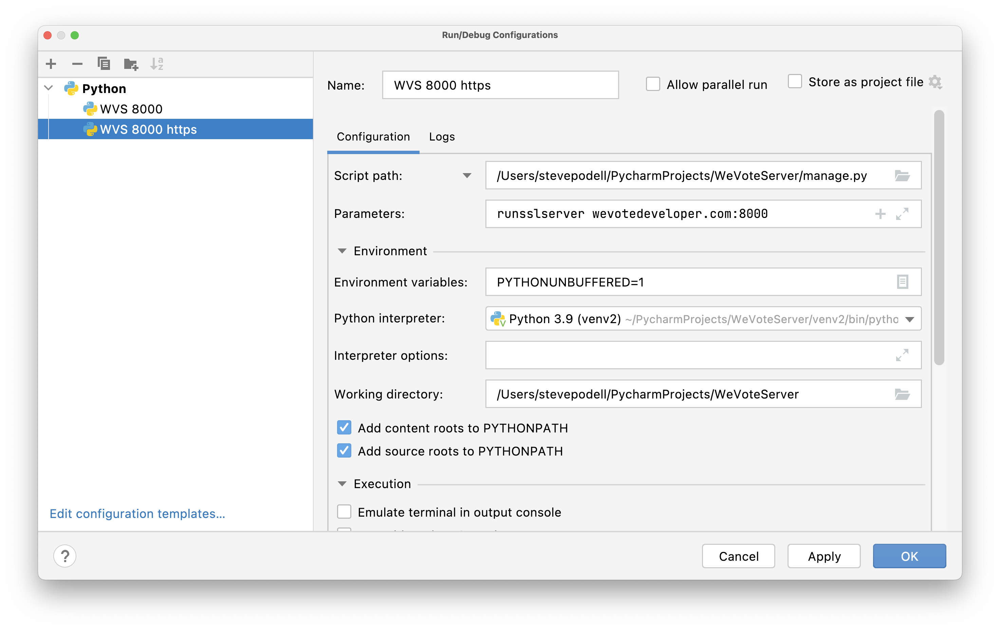
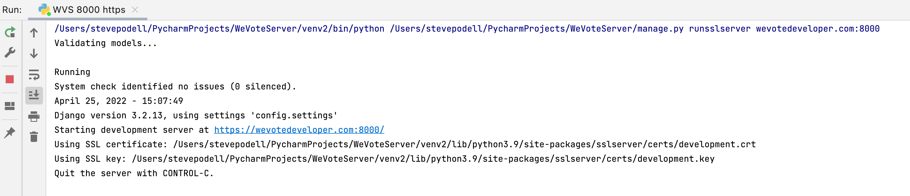

# OAuth for Facebook and Twitter on the API Server

Changed the Python server SDK to V12.0 on April 25, 2022 (from V6.0).  V13 was the latest version of that time, but social-auth-app-django==5.0.0 (social_django) had problems with it.   

###Nomenclature: 
**social-auth-app-django** is the same as **social_django** 

Installation of social-auth-app-django has already been done for you, but...
```shell
$ pip install social-auth-app-django
```
installs both 
```
social-auth-app-django==5.0.0
social-auth-core==4.2.0

```

## Run your local python api server in SSL (https)

In your environment_variables.json
replace all (6) urls that contain `http://localhost:8000/` (or 8001), with `https://wevotedeveloper.com:8000/`

(Explanation at https://github.com/teddziuba/django-sslserver)

Then start an SSL-enabled debug server:




or 

```
  $ python manage.py runsslserver wevotedeveloper.com:8000
```

and access the API Server Python Management app on https://wevotedeveloper.com:8000

The first time you start up the [runsslserver](https://github.com/teddziuba/django-sslserver) the app may take a full minute to respond to the first request.

### Make a small necessary change to your /etc/hosts

Facebook will no longer redirect to localhost, so make a second alias for 127.0.0.1 with this made up domain: `wevotedeveloper.com`

From the python-social-auth docs: "[If you define a redirect URL in Facebook setup page, be sure to not define http://127.0.0.1:8000 or http://localhost:8000 because it won’t work when testing. Instead I define http://wevotedeveloper.com and setup a mapping on /etc/hosts.](https://python-social-auth.readthedocs.io/en/latest/backends/facebook.html)"

So we have to make a small change to /etc/hosts.  This is the before:
```
    (venv2) stevepodell@StevesM1Dec2021 WeVoteServer % cat /etc/hosts
    ##
    # Host Database
    #
    # localhost is used to configure the loopback interface
    # when the system is booting.  Do not change this entry.
    ##
    127.0.0.1       localhost
    255.255.255.255 broadcasthost
    ::1             localhost
    (venv2) stevepodell@StevesM1Dec2021 WeVoteServer % 
```
We have added a fake local domain `wevotedeveloper.com` for the [Facebook Valid OAuth Redirect URIs](https://developers.facebook.com/apps/1097389196952441/fb-login/settings/), 
you need to add that domain to your 127.0.0.1 line in /etc/hosts.  After the change:
```
    (venv2) stevepodell@StevesM1Dec2021 WeVoteServer % cat /etc/hosts
    ##
    # Host Database
    #
    # localhost is used to configure the loopback interface
    # when the system is booting.  Do not change this entry.
    ##
    127.0.0.1       localhost wevotedeveloper.com
    255.255.255.255 broadcasthost
    ::1             localhost
    (venv2) stevepodell@StevesM1Dec2021 WeVoteServer % 
```

You will need to elevate your privileges with sudo to make this edit to this linux system file ... ` % sudo vi /etc/hosts` or with some other editor.

Note July 2022:  The auto generated certificate that is made by runsslserver generates warnings in browsers (not really a problem),
but may stop the JavaScript builtin fetch() function from completing.  The browser extension has to use fetch.


## Facebook
In environment_variables.json, these two variable need to be set:  
  ```
  "SOCIAL_AUTH_FACEBOOK_KEY":        "1...1",
  "SOCIAL_AUTH_FACEBOOK_SECRET":     "7...b", 
  ```

These keys are generated (or regnerated), and there is only one chance to copy them
down, since they will never again be visible on the Facebook console.

(Ask Dale to get the latest values.)


### Facebook OAuth 2, redirect URLS
These two urls point to the API server destination, for returning from OAuth with a successful login.  They have already been 
registered with Facebook on the [Facebook Login Settings](https://developers.facebook.com/apps/1097389196952441/fb-login/settings/) page under Valid OAuth Redirect URIs.

In case something changes, these are the configurations that we have made.

We have an entry `https://wevotedeveloper.com:8000/complete/facebook/` for testing with a local Python API Server running on your local,
and we have a second entry for production: `https://api.wevoteusa.org/complete/facebook/`, both of these values are already setup for you. 


### Debugging Facebook Oauth

Just a list of starting points for next time.

This is the key file for Oauth2: `venv2/lib/python3.9/site-packages/social_core/backends/facebook.py`

```curl -i -X GET "https://graph.facebook.com/v12.0/oauth/access_token?client_id=1097389196952441&redirect_uri=https%3A%2F%2Fwevotedeveloper.com%3A8000%2Fcomplete%2Ffacebook%2F&client_secret=<secret>&code=<code generated by previous leg in OAuth>"```

https://github.com/python-social-auth/social-app-django

https://github.com/python-social-auth/social-core

Sign in with Facebook   https://api.wevoteusa.org/login/facebook/?next=.

https://python-social-auth.readthedocs.io/en/latest/backends/facebook.html

https://medium.com/@kennethjiang/python-social-auth-for-django-tutorial-16bbe792659f

## Twitter
In environment_variables.json, these two variable need to be set:  
  ```
  "SOCIAL_AUTH_TWITTER_KEY":        "w...w",   Twitter calls this the "API Key" from the "Consumer Keys" section
  "SOCIAL_AUTH_TWITTER_SECRET":     "4...H",   Twitter calls this the "Secret" from the "Consumer Keys" section
  ```
(Ask Dale to get the latest values.)

### Twitter OAuth 2, redirect URLS
On the [Twitter Console](https://developer.twitter.com/en/portal/projects/1498394651836891139/apps/23523312/auth-settings), the Callback URI / Redirect URL list needs to include for the development app "WeVote Ballot":
  ```
  https://wevotedeveloper.com:8000/complete/twitter/
  ```
And for the production App "We Vote Ballot Guide":
  ```
  https://api.wevoteusa.org/complete/twitter/
  ```

### Debugging Twitter Oauth

Terminology could be more consistent in the Twitter and social_django docs 
* App Key === API Key === Consumer API Key === Consumer Key === Customer Key === oauth_consumer_key
* App Key Secret === API Secret Key === Consumer Secret === Consumer Key === Customer Key === oauth_consumer_secret
* Callback URL === oauth_callback

https://developer.twitter.com/en/docs/authentication/oauth-1-0a/obtaining-user-access-tokens
https://developer.twitter.com/en/docs/authentication/api-reference/request_token
